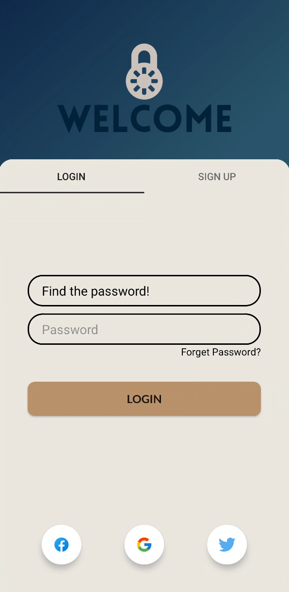
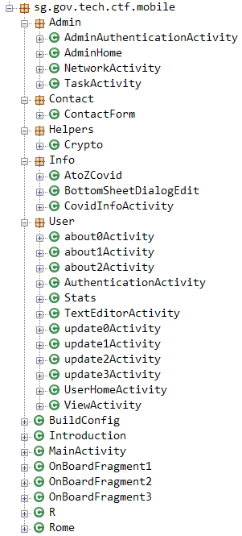
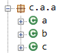
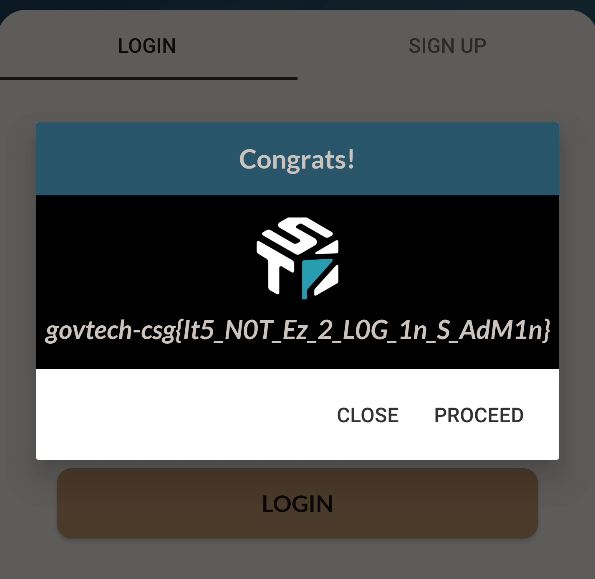

## Foreword
This challenge actually comes before challenge 3, titled "What's with the Search?". The numbering is slightly weird, hence in both writeups I might repeat some things already mentioned in the other just in case some people are only interested in one. Also a disclaimer, there are actually 3 ways that I found that lets you complete the challenge, and I'll also let you know the way that I actually initially used to solve it before discovering the other methods. But of course, I'll start from the most basic (with no android knowledge) way, an unnecessarily complex way, and then reveal the ever-so-slightly cheesy way. :)

You can download the challenge file (mobile-challenge.apk) from [here](https://drive.google.com/file/d/1tf8-C1FKYBMKGICRKYe7abGGs3LX2i2m/view?usp=sharing).

## Challenge Description
> True or false, we can log in as admin easily.

# Baby Steps
To begin the challenge, let's take a look at the home screen of the Korovax Mobile app (after getting past the starting animation and tapping on "Begin"):


We can see that there are 4 buttons: Admin Login, User Login, Info Page and Contact Us. From the challenge description, we know that what we want to do here is to log in as admin. So we tap into Admin Login:



We can see that the username portion is already filled up with "Find the password!" and there is a password field for us to fill in, with a Login button. But we also notice a sign up tab, but after tapping into it and playing around, we realize that it does nothing (the "Sign Up" button is just a dead button). We head back to the Login screen and tap "Forgot Password?", and a toast pops up: `Hint: 32 characters with special characters and spaces. TABLE name: Users, password column: you know it! :)`

Hmm, curious, but we'll keep that in mind. Perhaps that could mean that the password is 32 characters long? As for the table name, etc, the hint mentions "You know it!", and from experience on another easier challenge, this meant that we have to do some reversing and the answer should be in front of our eyes. We also tap on the Login button just to see what it does if the password is wrong: it just creates a Toast that says `false`. Well ok, I guess it's time to decompile the APK.

# Decompiling the APK
Now, there are many ways to approach decompiling the APK, but two of the most popular ways are: APKTool to decompile the APK into smali code, and JADX-GUI, to provide a pseudo-code presentation of what the original functions and classes could have been. For this method, we will be doing the more traditional way, which is using JADX-GUI, because smali code can be slightly confusing for those that have never worked with it before.

We fire up JADX-GUI and decompile the APK. We first need to look for the functions that we are interested in. The most obvious one to look for would of course be the screen(s) that we can directly see in the app. Right upon opening the source code folder, I was greeted with the ever-so-familiar view of multiple packages with placeholder names like "a" and "b". However there is a `sg.gov.tech.ctf.mobile` package, so let's start from there, expanding all the packages within this package:



Looking at all the classes, `AdminAuthenticationActivity` seems like a very good place to start. We click into it, and we realize that it is just a fragment holder, and it passes args to create 2 fragments, the "Log In" and "Sign Up" fragments. We can also see that the fragments were created by this particular function:
```java
@Override // a.k.a.n
public Fragment getItem(int position) {
  if (position == 0) {
    return new f.a.a.a.a.a.a();
  }
  if (position != 1) {
    return null;
  }
  return new c();
}

```

We need to dive deeper now.

# Wrappers Upon Wrappers
Let's take a look inside `f.a.a.a.a.a` (class `a` inside the `f.a.a.a.a` package). Reading through the code, we can see an `onCreateView()` and `onClick()` listeners, but there's a particular snippet that's interesting, at the very end of `onCreateView()`:
```java
this.f2853e.setOnClickListener(new View$OnClickListenerC0060a(this, root));
this.f2852d.setOnClickListener(new b(root, dbHelperAdmin));
```

These are the only 2 interactable buttons within the Login fragment. `dbHelperAdmin` likely is for the login button from the name alone, but we can double confirm it later. What's curious here is the way the `onClick()` is handled for the Login button, which  creates a new instance of this class: `new b(root, dbHelperAdmin)`. Looking at the functions we see the b class defined as this:
```java
public class b implements View.OnClickListener {
```

Ah, so `b` is just an `OnClickListener`. What does its constructor and `onClick()` look like then? Since `new b(root, dbHelperAdmin)` was used to create a `b` object.
```java
public b(ViewGroup viewGroup, f.a.a.a.a.c.b bVar) {
    this.f2855b = viewGroup;
    this.f2856c = bVar;
}

public void onClick(View v) {
  if (a.this.f2851c.getText().toString().contains(c.a.a.a.a(-891818782648L))) {
    c.a builder = new c.a(this.f2855b.getContext());
    View view = LayoutInflater.from(this.f2855b.getContext()).inflate(R.layout.custom_alert, (ViewGroup) null);
    ((TextView) view.findViewById(R.id.RES_2131296615)).setText(c.a.a.a.a(-1033552703416L));
    ((TextView) view.findViewById(R.id.alert_detail)).setText(c.a.a.a.a(-1076502376376L));
    builder.h(c.a.a.a.a(-1252596035512L), new DialogInterface$OnClickListenerC0061a());
    builder.f(c.a.a.a.a(-1286955773880L), new DialogInterface$OnClickListenerC0062b());
    builder.k(view);
    builder.l();
    return;
  }
  try {
    new Thread(new c(new Handler())).start();
  } catch (Exception e2) {
    Toast.makeText(this.f2855b.getContext(), c.a.a.a.a(-1312725577656L), 0).show();
  }
}

```

Ok, this is quite a lot to digest at first look, so let's break it down slowly. The constructor for `b` takes in 2 arguments, a `ViewGroup` object and a `f.a.a.a.a.c.b` object. `onClick()` calls an interesting function that we should keep in mind: `c.a.a.a.a(long)`. It seems to take in a `long` everytime. `f2855b` was defined as the `ViewGroup` in the constructor.

We know already that one potential way to solve the challenge is to find out how to meet the condition of the `if` statmement, which just checks if the user's input contains the return value of this curious `c.a.a.a.a(long)` function.

Let's take a look at `c.a.a.a.a()` It is within the `c.a.a` package, so let's expand that:



It contains 3 classes, and upon closer inspection we can see that the classes call functions from its sister classes. Let's take a look at our class of interest, `c.a.a.a`:
```java
package c.a.a;

public class a {

  public static final String[] f2669a;

  static {
    String[] strArr = new String[1];
    f2669a = strArr;
    strArr[0] = "{LONG UNICODE STRING}";
  }

  public static String a(long j) {
    return b.b(j, f2669a);
  }
}
```

I have redacted the string in the array as it is an extremely long string, and it looks like a messy block of jumbled-up characters, e.g. `衍ﾷﾖ렏궵澸ퟢ枱�...`. From this, we could tell it was likely Unicode. The function inside, `a(long)`, is the function that gets called, and it calls `b()` from the `b` class:
```java
public class b {
  public static String b(long id, String[] chunks) {
    long state = c.a(c.c(id & 4294967295L));
    long state2 = c.a(state);
    int index = (int) (((id >>> 32) ^ ((state >>> 32) & 65535)) ^ ((state2 >>> 16) & -65536));
    long state3 = a(index, chunks, state2);
    int length = (int) ((state3 >>> 32) & 65535);
    char[] chars = new char[length];
    for (int i = 0; i < length; i++) {
      state3 = a(index + i + 1, chunks, state3);
      chars[i] = (char) ((int) ((state3 >>> 32) & 65535));
    }
    return new String(chars);
  }

  public static long a(int charIndex, String[] chunks, long state) {
    return (((long) chunks[charIndex / 8191].charAt(charIndex % 8191)) << 32) ^ c.a(state);
  }
}
```

First we notice that it calls function `a()` from class `c`, but just by looking at this code, we can see that what `c.a.a.a.a()` does is just take in a long and retrieve a string from a string array. Now, we do the pro gamer move of reverse engineering: copy paste the decompiled functions into our own makeshift harness so we can read the contents. Of course, this isn't normally doable because disassembled C code is a jumbled mess, but in this case with the decompiled mapped Java Android code we can do this. Simply copy paste all 3 classes, create a Main.java that calls `c.a()` and we will be able to decipher all the weird calls. We can test it out with `a.a(-2760552376L)` that we saw earlier in `f.a.a.a.a.a`.
```java
public class Main {
  public static void main(String[] args) {
  System.out.println(a.a(-2760552376L));
}
```
```
Hint: 32 characters with special characters and spaces. TABLE name: Users, password column: you know it! :) 
```

Nice, we now have a working utility to help us solve the challenge.

Remember the `if` condition earlier? Well, we can now just simply peek into what the string it compares against is:
```
My_P@s5w0Rd_iS-L34k3d_AG41n! T_T
```

Is that the password already? It does contain exactly 32 characters, which was what the hint was mentioning at the beginning. Let's try it out:



Voilà, we have solved the challenge.

# Further Examination
Well, it also got me thinking, what if someone completely missed the `if` statement? It honestly is pretty impossible, but what if someone was playing the CTF after having not slept for 48 hours (please don't do this)? Well, there is actually another place where we will be able to find out what the password is. This is assuming we COMPLETELY MISS the if statement comparison.

Let's go back to where we were before in `f.a.a.a.a.a`. There was still one more function that we haven't looked at: `f.a.a.a.a.c.b`. We open it up to take a look, and then we realize that it is a class that initializes the login database. We are greeted with calls to `a.a(long)`, but class `a` within the package does not have a static function `a`, but since it takes in a `long` and the class imports `c.a.a.a`, we can assume that it is calling the static function `a(long)` within `c.a.a.a` instead. We note down a few interesting functions:
```java
public boolean b(String user, SQLiteDatabase db) {
  Cursor cursor = db.rawQuery(a.a(-2227553611704L) + user + a.a(-2390762368952L), (String[]) null);
  if (cursor == null || !cursor.moveToFirst()) {
    return false;
  }
  return true;
}

public void a(SQLiteDatabase sqLiteDatabase) {
  sqLiteDatabase.execSQL(a.a(-2403647270840L));
}

public boolean d(String id, SQLiteDatabase sqLiteDatabase) {
  Boolean returnValue = false;
  try {
    Cursor cursor = sqLiteDatabase.rawQuery(a.a(-2712884916152L) + id + a.a(-2876093673400L), (String[]) null);
    if (cursor != null && cursor.getCount() > 0) {
      returnValue = true;
    }
    cursor.close();
  } catch (Exception e2) {
    returnValue = false;
  }
    sqLiteDatabase.close();
    return returnValue.booleanValue();
}
```

We fire up our utility from earlier and run all the strings through:
```java
System.out.println(a.a(-2227553611704L));
System.out.println(a.a(-2390762368952L));
System.out.println(a.a(-2403647270840L));
System.out.println(a.a(-2712884916152L));
System.out.println(a.a(-2876093673400L));
```
```
SELECT * FROM Users WHERE username= '
';
INSERT INTO Users VALUES ('admin', 'My_P@s5w0Rd_iS-L34k3d_AG41n! T_T');
SELECT num FROM Numbers WHERE num = '
';
```

We see this particular string: `INSERT INTO Users VALUES ('admin', 'My_P@s5w0Rd_iS-L34k3d_AG41n! T_T');`, which seems like the database entry for the admin user. Let's double check by substituting it back into the function:
```java
public void a(SQLiteDatabase sqLiteDatabase) {
  sqLiteDatabase.execSQL("INSERT INTO Users VALUES ('admin', 'My_P@s5w0Rd_iS-L34k3d_AG41n! T_T');");
}
```

And we look back inside `f.a.a.a.a.a`, inside `onCreateView()` (it calls `c.a.a.a.a()` again to retrieve strings, but I'll save the trouble and put the relevant string (the second call inside dbHelperAdmin.b()) directly in:
```java
f.a.a.a.a.c.b dbHelperAdmin = f.a.a.a.a.c.b.c(root.getContext());
SQLiteDatabase db = dbHelperAdmin.getWritableDatabase(c.a.a.a.a(-1338495381432L));
if (!dbHelperAdmin.b("admin", db)) {
  dbHelperAdmin.a(db);
}
```

And into "`dbHelperAdmin.b()`" (once again I'll save the trouble and put the strings retrieved by calling `c.a.a.a.a()` directly in):
```java
public boolean b(String user, SQLiteDatabase db) {
  Cursor cursor = db.rawQuery("SELECT * FROM Users WHERE username= '" + user + "';", (String[]) null);
  if (cursor == null || !cursor.moveToFirst()) {
    return false;
  }
  return true;
}
```

Basically if the user `admin` does not exist, call "`dbHelperAdmin.a()`", which we earlier found querys the database with `INSERT INTO Users VALUES ('admin', 'My_P@s5w0Rd_iS-L34k3d_AG41n! T_T');`. Voilà.

# Solving By Patching APK
Remember the cheese method I was talking about at the beginning? Well, this was the original way that I actually solved this challenge, so this will be a walkthrough of basically what went through my mind as I was going along solving the challenge. Let's talk smali.

Smali is a decompilation format for the dex format, which is used by dalvik, Android's Java VM implementation. The syntax is slightly confusing as it is basically pure pseudo-code, but what's great is that we can actually modify smali code and use APKTool to recompile it into an APK, then use another tool like Uber APK Signer to sign our APK so we can install the patched APK on our phone. Let's first use APKTool to decompile the APK:
```
$ apktool d mobile-challenge.apk
```

This will create a folder `mobile-challenge`, and inside it will be a folder `smali` which contains the smali code for all the different classes. In this case, our class of interest as discussed earlier is the `f.a.a.a.a.a` class, which is the login fragment for the admin page. We know that there is an `if` statement that checks for a condition before it allows us to log in:
```java
if (a.this.f2851c.getText().toString().contains(c.a.a.a.a(-891818782648L))) {
  c.a builder = new c.a(this.f2855b.getContext());
  View view = LayoutInflater.from(this.f2855b.getContext()).inflate(R.layout.custom_alert, (ViewGroup) null);
  ((TextView) view.findViewById(R.id.RES_2131296615)).setText(c.a.a.a.a(-1033552703416L));
  ((TextView) view.findViewById(R.id.alert_detail)).setText(c.a.a.a.a(-1076502376376L));
  builder.h(c.a.a.a.a(-1252596035512L), new DialogInterface$OnClickListenerC0061a());
  builder.f(c.a.a.a.a(-1286955773880L), new DialogInterface$OnClickListenerC0062b());
  builder.k(view);
  builder.l();
  return;
}
```

I took a look at this and thought "I really don't wanna touch those wrappers if possible", so I thought "what if I patched the APK such that the condition check will either 1) always be true or 2) not even be there?" We know that the condition check is within another class defined in `f.a.a.a.a.a`, class `b`, so I opened up the smali code for `f.a.a.a.a.a.b` and looked for condition checks. Condition checks in smali is represented by code similar to:
```
sget-object v1, Lf/a/a/a/a/c/a;->a:Lf/a/a/a/a/c/a;

if-nez v1, :cond_0

...

:cond_0
```

With "..." representing truncated code and `:cond_0` encasing the action to carry out if the condition `cond_0` is met. `cond_0` is defined by the if comparison `if-nez v1`. Let's get back to looking for the condition check:
```
.line 75
.local v0, "password":Ljava/lang/String;
const-wide v1, -0xcfa48aafb8L

invoke-static {v1, v2}, Lc/a/a/a;->a(J)Ljava/lang/String;

move-result-object v1

invoke-virtual {v0, v1}, Ljava/lang/String;->contains(Ljava/lang/CharSequence;)Z

move-result v1

if-eqz v1, :cond_0

.line 76
new-instance v1, La/b/k/c$a;

iget-object v2, p0, Lf/a/a/a/a/a/a$b;->b:Landroid/view/ViewGroup;

invoke-virtual {v2}, Landroid/view/ViewGroup;->getContext()Landroid/content/Context;

...

.line 102
.end local v1    # "builder":La/b/k/c$a;
.end local v2    # "view":Landroid/view/View;
.end local v3    # "title":Landroid/widget/TextView;
.end local v4    # "details":Landroid/widget/TextView;
goto :goto_0

.line 105
:cond_0
```

Similarly, the truncated code is represented by "...". Here we can see that after this specific condition `cond_0` is checked and is true, immediately `getContext()` is called, which matches perfectly with our earlier decompiled code in JADX-GUI. So let's try removing the condition. To remove the condition check, we just need to remove these parts:
```
const-wide v1, -0xcfa48aafb8L

invoke-static {v1, v2}, Lc/a/a/a;->a(J)Ljava/lang/String;

move-result-object v1

invoke-virtual {v0, v1}, Ljava/lang/String;->contains(Ljava/lang/CharSequence;)Z

move-result v1

if-eqz v1, :cond_0
```
```
:cond_0
```

The latter `:cond_0` is the one at the very end of the earlier-shown smali code snippet. Leave all the code in the middle intact to make sure whatever is executed if condition check passes is still executed (if we remove it we literally remove the successful execution).

But wait, it can't be this easy, right? Let's build the patched APK with APKTool and sign it with Uber APK Signer, then install it on our device with adb:
```
$ java -jar apktool_2.5.0.jar b mobile-challenge -o ./mobile-patched.apk 
$ java -jar uber-apk-signer-1.2.1.jar -a mobile-patched.apk
$ adb install mobile-patched-aligned-debugSigned.apk
```

We open up the admin login panel, tap "LOGIN", and tadah, we're in, again (I realize you can't see that my password input is empty but please just take my word for it xD):


No password required, no complex reverse engineering analysis required. Just pure patching.

# Afterword
Yes, I know, the "Further Examination" section is slightly overkill, isn't it? There's no way someone will actually miss the if statement like that, if they're already going to do analysis on `c.a.a.a`. But well hey, it's always interesting to find even more paths to solve the challenge and even more methods to reverse engineer a specific application. Overall, this challenge was pretty simple and doesn't require much knowledge on even Java Android to solve. Overall, I hope that those that don't do Android reverse engineering would also be able to learn something from this writeup, and those that never touched smali code will get off their backs and start to tinker with smali. It really is a rewarding feeling when your patched APK not only does not crash but also performs the function that you want perfectly.

Thanks for reading.