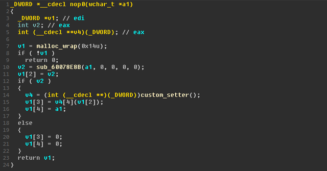
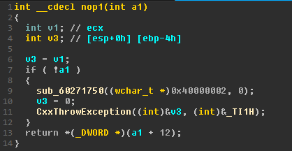
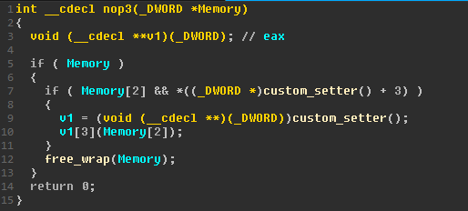

## Foreword
At long last, the harness has finally been finished. Throughout the remainder of this journey, after all those sleepless nights and hair-tearing, we've finally managed to figure out how to (for the most part) accurately harness `JP2KLib.dll`. We actually found out along the way that there are some things that the article got wrong.

For this last stretch of harnessing Adobe's JPEG2000 library, I was fortunate enough to get the help of another talented intern to help with reverse engineering some specific parts of `JP2KLib.dll`, and whom played a large part in helping to complete the harness.

In this post, I will be going through how we finished the harness from where I left off the last post, what things we discovered along the way as well as some initial fuzzing results. Without further ado, let's start.

# Understanding And Fixing What's Broken
Firstly, we had to figure out what was not working for us, and what was. We did not know if we were hitting the right code or if we even had good coverage at all. But from the test runs of the harness, it seemed almost as if we either weren't hitting the correct parsing code or we were doing something wrong while trying to harness the functions. Let's recap the target that was set at the end of the last post:

1. When running through windbg, `JP2KImageDecodeTileInterleaved` ALWAYS returned 0, but mine would always return 8.
2. nop0 was called at the end of `JP2KImageDecodeTileInterleaved`, and even though the article mentioned nothing about implementing that, after setting a breakpoint in windbg it turned out that nop0 was likely an important parsing function as it eventually lead to multiple calls of `CopyRect` and it seemed to call many important subroutines in IDA as well.

We thought that by fixing these issues our worries would have mostly gone away, but as it turned out this only revealed that we had finally cracked the tip of the iceberg and was then finally ready to move on to the rest of that gargantuan iceberg.

Let's begin with fixing `JP2KImageDecodeTileInterleaved`. The reason it returned 8, we figured, was likely because it wasn't correctly decoding the image. This brings us to point #2: nop0 was doing something and we didn't implement it. Turned out, my intuition was pretty spot-on, and nop0, nop1 and nop3 (nop2 is a function that just returns 0) all had a role to play in ensuring that `JP2KImageDecodeTileInterleaved` worked the way it was supposed to work. Let's start by taking a look at nop0 in IDA:



This is a rather confusing block of code. `custom_setter()` is a weird wrapper around some functions, which from further analysis seemed to be memory-related functions like `malloc` etcetera. We concluded that essentially what nop0 was doing was that it created a struct of size 0x14, held 2 pointers both `malloc`'d to the input size and then set its third and fourth variable (v1[3] and v1[4], because v1[0] is a pointer to itself) to the input size. So we ended up with a nop0 that looked something like this:
```c
void* nop0(int size) {
  s1* nstruct = (s1*)malloc((sizeof(s1)));
  nstruct->p1 = malloc(size);
  nstruct->p2 = malloc(size);
  nstruct->size = size;
  nstruct->size2 = size;
  return nstruct;
}
```

`s1` is a custom struct that contained 2 pointers, `p1` and `p2`, and 2 integers, `size` and `size2`. It then returns the pointer of the struct (`return v1`). The order as seen in IDA is as follows: `DWORD selfptr` at offset 0, `void* p1` at offset 0x4, `DWORD size` at offset 0x8, `void* p2` at offset 0xC and `DWORD size2` at offset 0x10.

We then ran the harness with only nop0 implemented, and the harness would crash at the next point: right after calling nop1. So we looked at nop1 in IDA as well to figure out how to implment it:



It has an `if` statement surrounding some code that throws an error, but we're mainly interested in what's not included in the exception (which is that the input did not exist): `return *(_DWORD *)(a1 + 12)`. From looking through windbg, we can see that:
```
0:000> g
Breakpoint 1 hit
Time Travel Position: AD831:3D0
eax=0f47e6c0 ebx=00000000 ecx=7a3f3600 edx=01000001 esi=7a3f3600 edi=00400000
eip=7a3f3600 esp=2653e99c ebp=2653e9bc iopl=0         nv up ei pl zr na pe cy
cs=0023  ss=002b  ds=002b  es=002b  fs=0053  gs=002b             efl=00000247
Acrobat!AX_PDXlateToHostEx+0x4183b0:
7a3f3600 55              push    ebp
0:013> pt
Time Travel Position: AD857:C4
eax=240604c8 ebx=00000000 ecx=6450b9c1 edx=40000000 esi=7a3f3600 edi=00400000
eip=7a3f36a8 esp=2653e99c ebp=2653e9bc iopl=0         nv up ei pl nz na pe nc
cs=0023  ss=002b  ds=002b  es=002b  fs=0053  gs=002b             efl=00000206
Acrobat!AX_PDXlateToHostEx+0x418458:
7a3f36a8 c3              ret
```
```
0:013> g
Breakpoint 2 hit
Time Travel Position: AD857:F2
eax=0f47e6e8 ebx=00000000 ecx=7a3f3740 edx=11010100 esi=7a3f3740 edi=241a6728
eip=7a3f3740 esp=2653e9a8 ebp=2653e9b4 iopl=0         nv up ei pl zr na pe cy
cs=0023  ss=002b  ds=002b  es=002b  fs=0053  gs=002b             efl=00000247
Acrobat!AX_PDXlateToHostEx+0x4184f0:
7a3f3740 55              push    ebp
0:013> dd esp
2653e9a8  79a15f16 240604c8
```

The latter box shows the value that nop1 takes as an argument, an object at address `240604c8`, which is the return value of nop0. This basically just means that it's returning `p2`, because if we look back at how `s1` was initialized, the pointer at offset 12 (0xC) is `void* p2`. So we implement nop1:
```c
void* nop1(s1* nstruct){
  return nstruct->p2;
}
```

As mentioned, nop2 is just a function that does nothing -- an actual nop function. When opening up in IDA, all it does is `return 0`. We now execute the harness, and hooray -- the harness now moves past nop1, but it now crashes after executing nop3, which means we have to implement nop3 as well. Looking at nop3 in IDA we see this:



Once again, it makes use of the annoying hard-to-reverse wrapper around memory functions. This time, it checks if the input pointer and its second element exists, then frees all of them. So effectively it's just a wrapper around `free()` that takes in a pointer to a struct and frees everything inside the struct. But we still need to find out what input value it takes, so we once again fire up windbg and this time we set a breakpoint at nop3:
```
0:000> g
Breakpoint 4 hit
Time Travel Position: 300C5F:62
eax=0f47e6d8 ebx=00000000 ecx=7a3f36c0 edx=01000001 esi=7a3f36c0 edi=2756cc98
eip=7a3f36c0 esp=2653ed28 ebp=2653ed34 iopl=0         nv up ei pl zr na pe cy
cs=0023  ss=002b  ds=002b  es=002b  fs=0053  gs=002b             efl=00000247
Acrobat!AX_PDXlateToHostEx+0x418470:
7a3f36c0 55              push    ebp
0:013> dd esp
2653ed28  79a15ed2 24065f48
```

We can see that it also takes in the return value of nop0, and now that we know that nop3 is a free wrapper around `s1`, we are able to implement nop3 as well. After implementing these 3 nop functions, we once again run the harness and finally it successfully runs `JP2KImageDecodeTileInterleaved`, returning with a value of 0. We thought that at this point we had finally completed our harness, so we ran it with WinAFL to double-check -- and thank god we did, because the stability seemed to crash immediately and stayed between 40-50%, which is obviously a really bad sign.

# Opening The Can Of Worms (And Actually Sovling The Problem)
At this point, we were really confused: if even after implementing nop0, nop1 and nop3 and seeing the harness execute properly it still had such low stability in WinAFL, we might have gotten some of the input parameters wrong. Our only option at this point was to once again manually step through the execution logic of Adobe Acrobat DC in windbg and see if we were missing any part of that logic. After some (very long and excruciating) time of stepping through breakpoints and even individual instructions, we discovered that quite a few things were not right:

1. The return value of `JP2KGetMemObjEx` was never used as an input value by any of the other functions that we were harnessing, so it did not need to be loaded in our harness at all.
2. `JP2KImageDecodeTileInterleaved` seemed to be called in a loop, not always just once or twice. The size of the loop also seemed to be determined by an external factor that we didn't know at the time.
3. `JP2KImageDecodeTileInterleaved` did not actually take in the return value of `JP2KImageGetMaxRes` as its third argument, instead `JP2KImageGetMaxRes` just always returned 0x5 while the actual value passed into `JP2KImageDecodeTileInterleaved` was a number anywhere between 0x0 to 0x5.
4. The second argument of `JP2KImageDecodeTileInterleaved` was not 0, that was just an error on my part when I first looked at it in IDA. It in fact increases with the loop iteration (0x0 on loop 1, 0x1 on loop 2 etc.).
5. `JP2KImageDataCreate` was called before each time `JP2KImageDecodeTileInterleaved` was called in the loop, and `JP2KImageDataDestroy` was called after. This meant that a new instance of `image_data` was used for each time `JP2KImageDecodeTileInterleaved` was called.
6. As it turned out, I had also incidentally swapped the positions of my arguments in `file_obj_seek`. `DWORD whence` (changed from `uint64_t whence` from the previous post) in fact came before `uint64_t offset` (changed from `int offset` from the previous post). So it was actually
```c
int file_obj_seek(FILE* fileptr, DWORD whence, uint64_t offset)
```
and not
```c
int file_obj_seek(FILE* fileptr, int offset, uint64_t whence)
```

Now that we've listed out all the problems, we had to get to solving them one by one. The first problem was easy to solve, we just needed to remove all code related to `JP2KGetMemObjEx`, and to really speak of it, it wouldn't have had such a big impact on the stability of the harness by itself.

We then needed to figure out what decided the amount of times that `JP2KImageDecodeTileInterleaved` was looped. Thanks to [this amazing article](https://googleprojectzero.blogspot.com/2019/10/the-story-of-adobe-reader-symbols.html) by Google's Project Zero team, we managed to get our hands on an old `JP2KLib` library and an old `AcroRd32` library (this works extremely similar to `Acrobat.dll`) that contained debugging symbols. At that time we did not notice that Project Zero had published another article that showed that MacOS in fact had newer versions of those libraries that contained debugging symbols, but it did not matter much as the libraries we managed to get served us well enough. We grabbed hold of the libraries by downloading the corresponding older versions of Acrobat Reader from Adobe's FTP server.

With the help of the mapped library, we figured out that there were 3 other functions that were at play: `JP2KImageGetGeometryParams`, `JP2KImageGeometryGetNumXTiles` and `JP2KImageGeometryGetNumYTiles`. The return value of the first function was passed into both the latter functions and a loop was formed with their return values. Inside the loop, those return values were then passed into `JP2KImageGeometryGetTileNum` which in turn returned the value that was passed in as the second argument to `JP2KImageDecodeTileInterleaved`. This completed our parsing loop logic and the harness did not break upon implementation (which was a really good sign). We ended up with a loop like this:
```c
void* geometryParams = JP2KImageGetGeometryParams_func(image);

int numXTiles = JP2KImageGeometryGetNumXTiles_func(geometryParams);

int numYTiles = JP2KImageGeometryGetNumYTiles_func(geometryParams);

for(int tileY=0; tileY<numYTiles; tileY++) {
  for (int tileX=0; tileX<numXTiles; tileX++) {
    //call JP2KImageGeometryGetTileNum
    int tile_num = JP2KImageGeometryGetTileNum_func(geometryParams, tileX, tileY);

    //create image data
    void* image_data = JP2KImageDataCreate_func();
    printf("JP2KImageDataCreate: ret = %p\n", image_data);

    //call DecodeTileInterleaved
    ret = JP2KImageDecodeTileInterleaved_func(image, tile_num, max_res, 8, 0xff, 0, image_data);
    printf("JP2KImageDecodeTileInterleaved called with params tile_num=%x, max_res=%d: ret = %d\n", tile_num, 5, ret);

    //destroy image data
    ret = JP2KImageDataDestroy_func(image_data);
    if (ret == 0)
      printf("image data destroyed.\n");
    }
}
```

With this, we tried to run the harness in WinAFL again to see if we were getting better stability. The stability would start very well at around 85%, but then eventually tumble its way down to a steady 40-45%. We were puzzled, because the fact that it started and maintained at relatively high stability for quite a while showed that it was likely due to some kind of memory leak that we didn't address, so we had to look through our whole harness again, and we eventually found out that the reason in fact WAS due to memory leaks. We called `free()` on all structs and pointers that we had initialized and suddenly our harness started working properly, maintaining 99-100% stability for a good amount of time before gradually decreasing as the paths found by the fuzzer started increasing into the 3000s and above.

# Preliminary Results and Final Words
Overall, this had been a pretty wild ride, considering the article that we were following got a few things very wrong (we even rolled back the version of our DLL to see if it was a version problem but as it turned out it was not), but it was nice to finally figure everything out and put things together. This had been an interesting series of events that familiarized me with C a lot more and also taught me a few things about the debugging-harnessing cycle.

We ran the fuzzer over a week and got quite a bit of crashes, but of which there were only 2 main types of crashes: one that ended up looping through the parsing code forever, and one that crashes when `JP2KImageDestroy()` was called on the crash-inducing jp2 image, but we were unable to cause crashes with either in Acrobat itself, so we concluded that it is likely Adobe has implemented a lot of their own error checking into Acrobat so as to prevent these kinds of crashes from happening. We will be running the fuzzer over the next few weeks with improved corpuses to see if we are able to catch anything, and I might post again if any worthwhile results were found.

Thanks for reading.