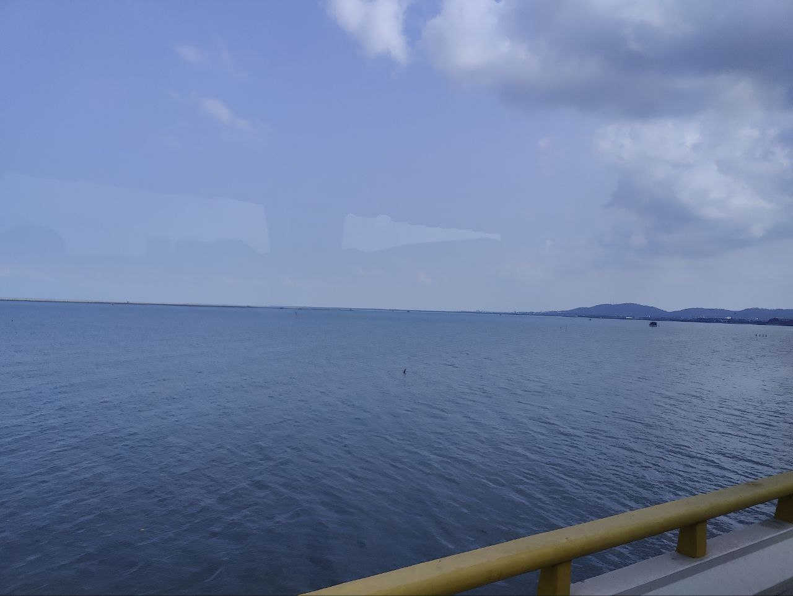
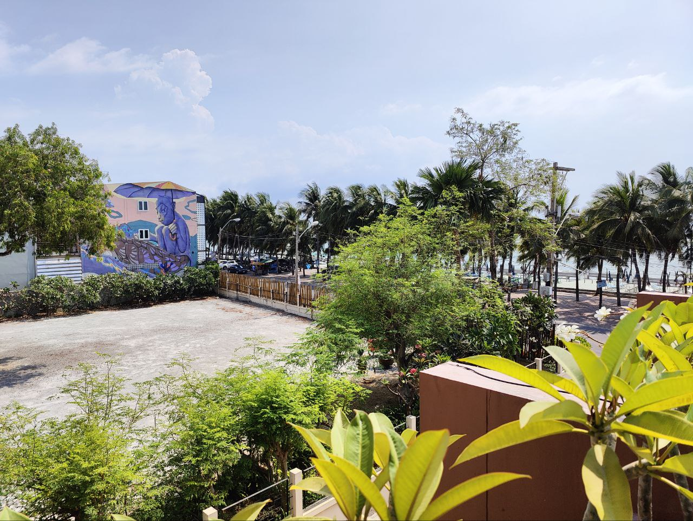
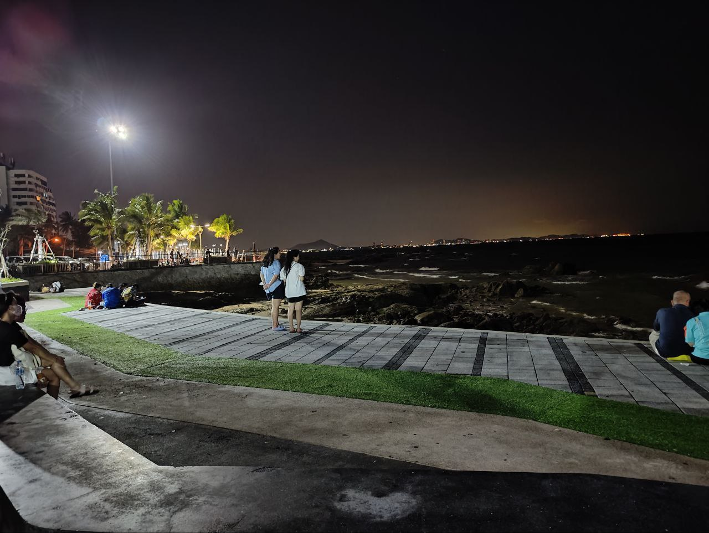
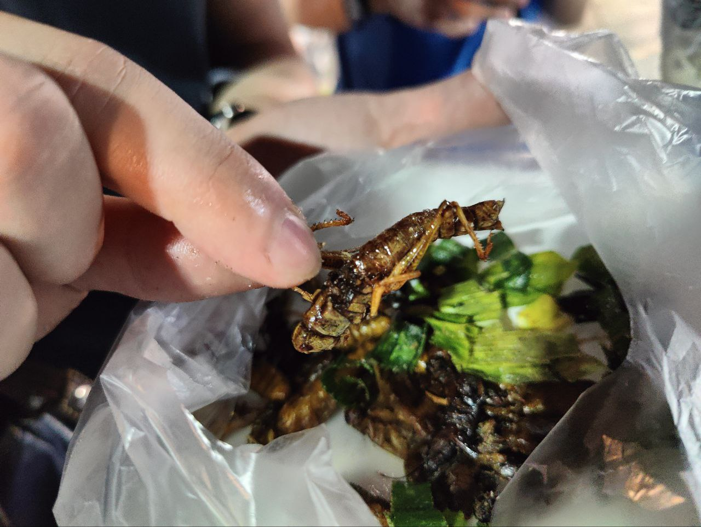
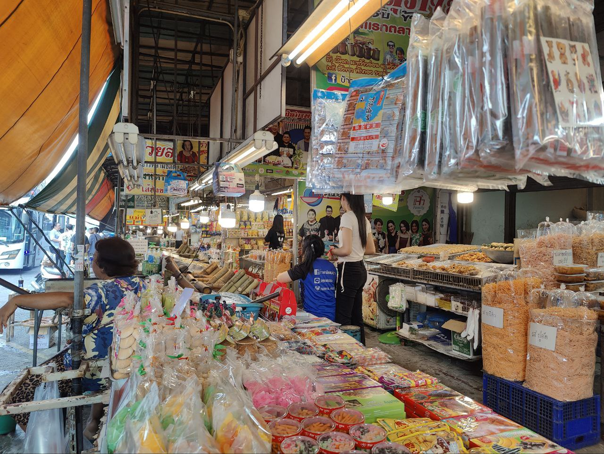
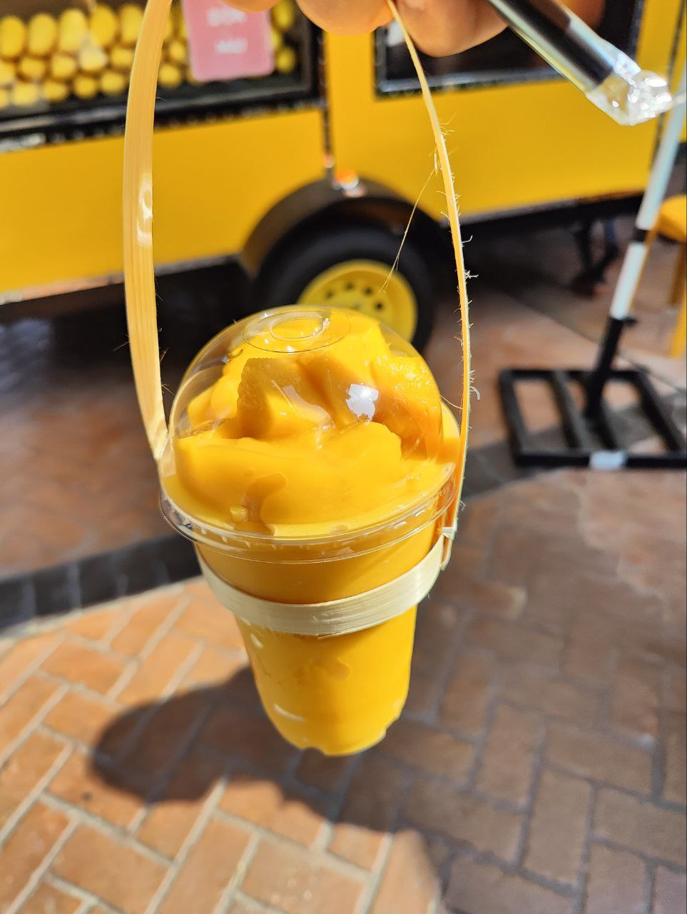

## Foreword

Two non-CTF blog posts in a row huh... guess I've really been slacking on CTFs as of late. School has been tougher than I thought and I promise after this semester I would have more time to start doing CTF writeups again. I've been selected to attend the [Global Cybersecurity Camp 2024](https://gcc.ac/) as part of Team Singapore, and together with some friends and some fellow members of NUS Greyhats, we set off to Bangsaen in Thailand for a 5-day conference. I would like to preface this by thanking Div0 SG for allowing me to be part of this experience, I am eternally grateful as this event was an amazing experience for me.

# GCC in Bang Saen, Thailand 🇹🇭

The topics were all pretty interesting, ranging from CTI (cyber threat intel) to car hacking. There were also afterparties and dinners organized for the staff, sponsors, and participants to mingle. There was a group project component that had us split into groups to work on topics given to us.

We were split into individual groups of 5, comprising people from different participating countries. Each group was given a topic and a problem statement, and we had to come up with a solution to the problem. Most of the topics were to be tackled with software engineering/web development, while there were 2 teams assigned the task of creating CTF challenges and deploying a CTF within 3 nights (then they would face off against each other).

## Opening Night

Shortly after arriving in Thailand on an early flight, we were transported to the conference venue beside Bang Saen beach. It had beautiful scenery, which unfortunately, at this point in time, I didn't know was going to be one of the only few times I would be able to appreciate it due to the hectic days coming up ahead.

_Travelling by the ocean to reach the hotel_

We arrived at the hotel, unpacked, and I joined some Team Singapore members in the pool to cool down before the opening dinner/ice breakers. One Team SG member also brought his roommate along (shoutout to [@slni_yi](https://twitter.com/slni_yi)), and we managed to chat a bit in the pool before dinner.

The opening night was a grand dinner in the main hall where I got to go around and speak to quite a few people. At this point, even though I had not really slept the previous night (rushing to finish all my homework), I was surprisingly awake. We had a mini afterparty with the Team Malaysia staff/sponsors, and I only went back to sleep around 2-3 am.

## Day 1

There were two main events on day 1, one of which was an obligatory digital ethics course. Nothing much happened except the usual topics that I've already been through in my university. By this time, we already knew our groups, and we were assigned our group topics for the project. The main focus on day 1 was AD attack techniques.

### Deep Dive into AD Attack Techniques by [Mars Cheng](https://www.linkedin.com/in/marscheng93)

> **This was one of the particularly interesting talks for me, as I had always been interested in learning more about AD attacks, but I never really had the time to do my own research. There were hands-on labs that led us to set up our own environment as well as try out various techniques. Boy, the pace was fast for me, as I had never really learned about AD before, but it was definitely satisfying because it wasn't just some slow-paced, stretched-out course like most university or external courses feel like. We learned about infiltration, lateral movement, kerberoasting, and creating gold and silver tickets for persistence. Overall, the talk was clear and concise, and the labs were intriguing to do hands-on.**

For our group project, we were assigned the task of building a plugin for [Maltego](https://www.maltego.com). None of us had any idea of what it was or what its capabilities were, let alone building a plugin for it. So, we spent most of the first night figuring out what we needed to do and also drafted a task manager for our team to execute our task pragmatically.

I spent the good part of the wee hours rushing my university homework. (╥﹏╥)

## Day 2

Day 2 saw two main talks - threat intel and kernel fuzzing.

### Handling Threat Intelligence by [Tomohisa Ishikawa](https://www.linkedin.com/in/tomohisaishikawa/)

> **This talk was my first time learning about threat intelligence, as I usually focus on vulnerability research and pwn/re in CTFs (the attacking side of things). It was an informative session that covered every base in minute detail, providing me with a lot of insight into what threat intelligence is, threat hunting, and the different levels of incident response within an organization. There were hands-on labs that led us to examine different samples and understand what it takes to construct a YARA rule to detect and filter malicious samples. Although I don't particularly enjoy doing forensics (as evidenced by my CTF categories), this was still a relatively engaging talk for me.**

### Fuzzing in the kernel world by [Yi-Han Wang (Lisa)](https://www.linkedin.com/in/yi-han-wang-299749208/)

> **This was a topic that was close to my heart. Although I hadn't previously conducted fuzzing on kernels due to a lack of knowledge and experience, I utilized AFL and WinAFL during my internship with STARLabs SG. Additionally, I had also managed to discover a CVE in Windows Explorer with the help of WinAFL. This talk was eye-opening as fuzzing kernels involves similar concepts to fuzzing applications but on a much lower-level stage, dealing with the handling of memory and CPU instructions. Honestly, I found myself getting a little lost when the theory on virtualization was discussed, but in the end, I still managed to grasp the idea behind it and what the fuzzer is targeting when fuzzing the kernel (the harness being a kernel hook instead of an application library hook, which I'm used to). Overall, the talk was a bit challenging but still very interesting.**

This night was a bit more productive as we had figured out the capabilities of Maltego. We were beginning to find data that we could work with, as well as establishing some basic functionalities we wanted our plugin to have. Each of us went back respectively and researched the API for Maltego TRX to prepare for work the following day. It was productive because we managed to identify the key problem statement, and due to that, we luckily did not fall into the trap of delving too deep into the technical aspects and forgetting to address the main problem.

Once again, I slaved away at my university homework (SWE homework), this time until almost 5 in the morning because my code either wasn't compiling correctly or wasn't running correctly. Coding Java on vim wasn't exactly helping either... 😢 ~~Being forced to code Java applications on vim through an ssh tunnel should be made illegal honestly...~~

## Day 3

_Finally, I managed to get a good photo from the pool balcony_

Day 3 saw two main talks as well - LLM prompt injection and forensics with [velociraptor](https://docs.velociraptor.app).

### How (not) to build a vulnerable LLM web app by [Shota Shinogi](https://www.linkedin.com/in/shota-shinogi/)

> **This was another topic that was slightly close to my heart. Back in ECSC 2023, we also encountered similar challenges that required us to perform prompt injection in order to obtain the flag. This topic was particularly interesting because nowadays many corporations are starting to use AI chatbots as part of their customer support, which could lead to unintended side effects if not properly sandboxed. We learned about the different techniques to bypass a chatbot's restrictions and various ways we could perform prompt injection or input manipulation. The talk also included hands-on labs with different vulnerable LLMs hosted by the speaker. Overall, the talk provided a nice change of pace from the fast-paced high-level learning of the past few days, and it was definitely enjoyable to learn.**

### Hunting with a dinosaur by [Andreas van Leeuwen Flamino](https://www.linkedin.com/in/andreasvanleeuwenflamino/)

> **This was a forensics-focused talk that had us engaging in threat hunting through Windows event logs using a tool called Velociraptor. It showcased the advantages of being able to filter out logs on the target machine rather than in post-processing, enabling a quicker workflow as the number of affected machines increases and when there are multiple concurrent machines to investigate. There were a few labs with a storyline scenario for us to follow as we searched for the point of intrusion on several machines. Although forensics isn't my area of interest, as previously mentioned, this was still overall a pretty interesting talk as I got to see and experience what a forensics workflow could be like.**

This was a significant night as we figured out two main things regarding our project: 1) we could successfully make use of Maltego transforms to create and link nodes together, which constituted the bulk of our task, and 2) we realized that the input for our project did not necessarily need to be sourced by us; we could use self-generated dummy data. This was thanks to Joshua from UNODC, who pointed out that there were already tools available to dump and process phone data. We just needed to specify the format required for the input data, rather than handling the data dumping and processing ourselves. With this newfound clarity, we began our work and managed to make significant progress that day, achieving our primary goals as established on day 1 of displaying the connection between phone data sets.

Once again, I was haunted by my university homework, though thankfully there wasn't much left by then and I could finish it relatively fast compared to the previous few days. I forwent attending the afterparty on day 3 altogether in order to finish up all my remaining homework (so I could enjoy the following few days' afterparties).

## Day 4

_Went out for a walk with Team SG for a breather_

Unfortunately, one of our team members fell ill the night before and he had to miss the entirety of day 4. As a fellow pwn/re player I felt he definitely would've enjoyed the talk on this day. Day 4 had 1 full-day talk on car hacking.

### Hands-on Car Hacking by [Kamel Ghali](https://www.linkedin.com/in/mohammad-kamel-ghali/)

> **Let me preface this by saying that the presenter was such a fun guy. We would always see him at the afterparties enjoying himself, and he was a treat to banter with throughout the entirety of GCC. Personally, I had always wanted to learn hardware hacking, but as a CS major, I never really had the chance to delve into the engineering/hardware side of things. Frankly speaking, it also felt pretty daunting because lots of physics and engineering knowledge come into play when hardware becomes the focus. This was an interesting talk that taught us about the Electronic Control Unit (ECU), CAN signals, and other aspects related to car hacking. We also had an introduction to basic Bluetooth hacking and got to play around with actual hardware during the lab sessions. This talk opened my eyes to the world of hardware hacking, and I seriously had fun throughout the entirety of the talk. Despite being a full-day talk, it didn't feel very long because we had many things to do, and everyone was tinkering with the different hardware.**

Day 4 was when we wrapped up our project. We managed to add the last bit of functionalities into our plugin and also pretty much finalized our presentation slides. Now, it was just time to play and pray. I can't actually even remember much of what happened at the afterparty specifically, but there were good alcohol and good people to talk to.

## Day 5

Our fallen team member came back on this day to rejoin us for the final day. Day 5 also featured one talk, this time on malware analysis, specifically .NET malware. As it was the last day of GCC, this was also the night of the project presentation where there was something at stake (top 2 teams would gain access to offsec playground and receive a $100 voucher). Additionally, it was also the day of the closing dinner.

### Practical Malware Analysis and .NET Reversing by [Wei-Chieh Chao](https://www.linkedin.com/in/oalieno/) and [Yi-Hsien Chen](https://www.linkedin.com/in/yi-hsien-chen-05b411138/)

> **This talk felt pretty homey to me, as I did a lot of .dll reversing during my internship with STARLabs SG. Reversing live malware samples coded in .NET just felt like a variation of what I was used to seeing. The lab was conducted in a CTF-like format, where we submitted values of specific data fields within the malware code as flags. I managed to finish the lab ahead of time, but it was still really interesting to listen to the explanation behind .NET application structure and execution logic. We also gained insights into how different malware execute their command and control, and even got to try our hands at using the C2 interface ourselves with a modified version of some leaked malware. Overall, this was a familiar talk for me, and the labs were fun.**

After the talk, it was time for the project presentation. I took on the role of presenting our project for my team as part of our role allocation, and it was a fun ride as I'm in my comfortable zone (of yapping in front of groups of people). This reminded me of my countless presentations throughout school, national service, as well as my talk at NUS Greyhats. We managed to clinch the top spot in our category, but unfortunately fell short of the top 2 overall. Despite this, the whole team remained positive about the outcome and had a lot of fun throughout the process, so I was also extremely satisfied with how it turned out in the end. After all, the prize is only part of the reward. We got to make international friends and laugh along with everyone while working on the project, which made the whole journey worth it.

_Assorted fried insects from the night market, they actually tasted pretty good_

## Closing Dinner

Together with some Team Korea members and the rest of Team Singapore, we went for a Thai massage before heading to the closing dinner. The massage was a little ticklish (and painful) at times but it was a good refresher after so many days of sitting down in front of my laptop.

## Afterword

Here are some notable pictures from the trip:

_A marketplace near our venue that we got to visit prior to returning to the airport_

_Beautiful mango smoothie from central village near the airport_

GCC 2024 will undoubtedly be one of my most unforgettable experiences, as it was also my first major cybersecurity conference. I had the opportunity to meet so many international friends and even achieved one of my personal goals. I learned many new things and gained invaluable insights from professionals in the cybersecurity industry. To all my international friends, thank you for making it such an interesting, fun, and unforgettable experience.

### Special Thanks

- **Div0 SG**
    - for sponsoring the trip and allowing me to participate as part of Team Singapore
- **GCC 2024 Sponsors**
    - for making the event possible
- **GCC 2024 Trainers**
    - for the extremely intruiging and engaging talks
- **GCC 2024 Staff**
    - for working tirelessly to ensure the smooth-sailing of the event
- **My teammates from GCC**
    - for being easy to work with and making GCC interesting
- **My teammates from Team Singapore**
    - for being so fun along the whole way from preparation to our return from GCC
- **Everyone I met at GCC**
    - for making the event an unforgettable one