## Foreword

I haven't been active for a while because of school and many other things (procrastination being one of them), but as I've returned to intern at a vulnerability research company, I've had the chance to look into some interesting vulnerabilities. I've wanted to learn Windows Kernel for the longest time so this was a pretty good opportunity to throw myself straight into it.

One particular vulnerability that caught my eye was CVE-2023-28252. It is a vulnerability that was exploited in-the-wild and had many different reports on it. Fortra published a POC and many companies (fortra, kapersky, google project zero, etc.) did an analysis on this, so I thought it would be a quick dive, but the more I looked into it, the more I realized 2 things:
1. Existing writeups mostly approach it from a malware analysis point of view, not an attacker's point of view
2. No writeups actually understand the way to obtain the primitive

This is actually quite evident in a *certain* POC that I looked at, where values that didn't need to be patched were being patched and the comments in the code were explaining things wrong. In fact, I know as a fact that it was copied from decompiled malware because there were obvious artifacts left inside like a `RunPayload()` function that was never called and variables like `v53`.

For the purposes of making the writeup less cluttered, the following "shorter" forms would be used:
```
Within CClfsBaseFilePersisted class:
CClfsBaseFilePersisted::WriteMetadataBlock -> WriteMetadataBlock
CClfsBaseFilePersisted::ReadMetadataBlock -> ReadMetadataBlock
CClfsBaseFilePersisted::ExtendMetadataBlock -> ExtendMetadataBlock
CClfsBaseFilePersisted::AddContainer -> AddContainer
CClfsBaseFilePersisted::AddSymbol -> AddSymbol
CClfsBaseFilePersisted::AllocSymbol -> AllocSymbol
CClfsBaseFilePersisted::OpenImage -> OpenImage
CClfsBaseFilePersisted::ReadImage -> ReadImage
CClfsBaseFilePersisted::CreateImage -> CreateImage

Within CClfsBaseFile class:
CClfsBaseFile::GetControlRecord -> GetControlRecord
CClfsBaseFile::FindSymbol -> FindSymbol
```

# BLF

There are already many good resources out there detailing the Common Log File System (CLFS) driver internals such as [Alex Ionescu's clfs-docs](https://github.com/ionescu007/clfs-docs/) and many more, but I will briefly walk through the structure of BLF files for the specific purpose of this vulnerability.

BLF files are created by CLFS and consists of 6 metadata blocks:
```
0x0    :    Control
0x400  :    Control Shadow
0x800  :    Base
0x8200 :    Base Shadow
0xFC00 :    Truncate
0xFE00 :    Truncate Shadow
```

The "shadow" blocks are backup copies of the main block and are used in case any corruption is detected in the main blocks.

Important offsets are as follows:

Control/Control Shadow
```
Control Block
* 0x4 → TotalSectors   // Total no. of sectors (2)
* 0x6 → ValidSectors   // No. of valid sectors
* 0x70 → DumpCount     // Pseudo-"version" number, higher = newer
* 0x84 → eExtendState  // CLFS_EXTEND_STATE enum
* 0x88 → iExtendBlock  // Index of block being extended
* 0x8A → iFlushBlock   // Index of block being flushed to disk

Control Shadow Block
* 0x406 → ValidSectors
* 0x470 → DumpCount
* 0x484 → eExtendState
* 0x488 → iExtendBlock
* 0x48A → iFlushBlock

CLFS_EXTEND_STATE : unsigned int32
{
ClfsExtendStateNone          = 0x0,
ClfsExtendStateExtendingFsd  = 0x1,
ClfsExtendStateFlushingBlock = 0x2,
};
```

Base/Base Shadow
```
Base Block
* 0x1B98 -> cbSymbolZone // Size of symbol zone

Base Shadow Block
* 0x9598 -> cbSymbolZone // Size of symbol zone
```

I strongly suggest going through the docs from above or other writeups for a more detailed explanation on file structure. However, the above knowledge is sufficient to understand the high-level concept behind CVE-2023-28252.

# Analysis of The Vulnerability

## High-level Overview

This vulnerability is caused by **improper handling of exceptions** leading to arbitrary increment that exists within the Windows `clfs.sys` driver.

Unlike what many analysis reports state, the root cause is **not** arbitrary read/write, heap overflow, OOB read/write, nor arbitrary increment. The arbitrary increment is a **primitive** that we can make use of due to the **improper handling of exceptions** within the `WriteMetadataBlock` function.

The vulnerability exists in the `WriteMetadataBlock` function. As the return value of `ClfsEncodeBlock` is not checked, even if it errors out, execution of `WriteMetadataBlock` will continue to completion and return a handle.

The way the exploit works is to make use of `ClfsDecodeBlock`'s CRC check to zero out the CRC of the CONTROL block, then making use of a subsequent `WriteMetadataBlock` -> `ClfsEncodeBlock` call to flush the invalid CONTROL block to disk, which in turn causes subsequent attempts to load the CONTROL record error out and use a malicious user-controllable CONTROL_SHADOW block instead.

This allows us to supplement our own `iFlushBlock` value, which is used to access an offset from a struct in kernel memory. This accessed value is then incremented, giving us our **arbitrary increment** primitive.

## The Root Cause

Within `ReadMetadataBlock`, `ClfsDecodeBlock` is called, which would set the in-memory checksum of the CONTROL header to 0:

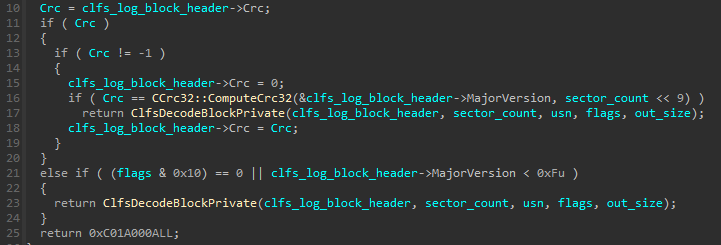

If decoding of the block is successful, the checksum would remain as 0 in memory while the block is being processed. The checksum is then calculated and set again before it is flushed to disk. We can see in `WriteMetadataBlock`, `ClfsEncodeBlock` is called, which in turn sets the checksum:

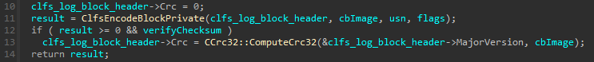

If any part errors out, **the checksum remains at 0** and an error is returned. This is where the vulnerability happens. We look back at `WriteMetadataBlock`:

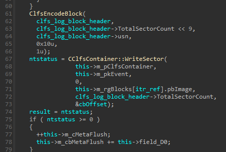

`ClfsDecodeBlock` is called and **its return value is not checked!** Execution would continue and `CClfsContainer::WriteSector` would execute, flushing the CONTROL block in memory to disk, **including the zeroed out checksum**.

The next time `ReadMetadataBlock` is called, it would fail when trying to read the corrupted CONTROL block (invalid checksum) and attempt to search for a CONTROL_SHADOW block. If the attacker supplies a valid CONTROL_SHADOW block with a malicious `iFlushBlock` value, it will be loaded into memory successfully and subsequently used by the driver.

Let's explore the code path to understand how different parts of the code are reached and how the vulnerability can be used to achieve our primitive.

## Code Path

Through debugging a skeleton application that only calls `CreateLogFile`, I found out that the execution path when creating a new log file is something like this:
```
CClfsLogFcbPhysical::Initialize
→ OpenImage
→ CreateImage
→ WriteMetadataBlock
```

OpenImage is not seen in the callstack when I was debugging but we can simply step through from `CClfsLogFcbPhysical::Initialize` and we will see that `CreateImage` is actually called through `OpenImage`

On the other hand, if `CreateLogFile` opens an existing file, it would be something like:
```
CClfsLogFcbPhysical::Initialize
→ OpenImage
→ ReadImage
→ ReadMetadataBlock
→ ExtendMetadataBlock   // If eExtendState != ClfsExtendStateNone
→ WriteMetadataBlock    // If eExtendState = ClfsExtendStateFlushingBlock
```

Even though the vulnerability is within `WriteMetadataBlock`, through debugging POCs I found online and playing around with CLFS I found out that the only way to ensure the CONTROL record is attempted to be read again (which would then load our malicious CONTROL_SHADOW into memory) after corrupting the CONTROL block with the first `WriteMetadataBlock` call is making sure that `GetControlRecord` is called.

We can look at the XREF for `GetControlRecord` in IDA:

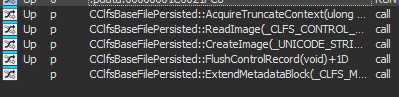

We can see above that `ExtendMetadataBlock` calls our desired function. In theory (and also seen in the ITW malware), we just need to ensure that we call `ExtendMetadataBlock` in order to guarantee our `GetControlRecord` and `WriteMetadataBlock` calls.

Thus, after we manage to obtain our patched BLF file one way or another, we would want to reopen it with `CreateLogFile` so that it would be read (thus corrupting the CONTROL block), then somehow reach `ExtendMetadataBlock` -> `GetControlRecord` -> `WriteMetadataBlock` again to load our malicious CONTROL_SHADOW into memory.

This can be done in user code by calling `AddLogContainer` and making sure that it calls `ExtendMetadataBlock`. Since we would have already called `CreateLogFile` to read and corrupt our CONTROL block, we can just use the handle returned by `CreateLogFile` to call `AddLogContainer`.

There is one caveat here: `AddLogContainer` does not call `ExtendMetadataBlock` by default, we need to somehow force it to also trigger `ExtendMetadataBlock`. We already know we can't patch the BLF file again at this juncture since it has already been loaded into memory by `CreateLogFile`, so we have to take a look at the code execution flow of `AddLogContainer`. I found out that it was something like this:
```
Win32 API AddLogContainer
→ CClfsLogFcbPhysical::AllocContainer
→ AddContainer
→ AddSymbol
→ FindSymbol (returns 0xC0000023)    // Obtained from AllocSymbol
→ AllocSymbol (returns 0xC0000023)
→ ExtendMetadataBlock                { This part is only reachable if error 0xC0000023
→ WriteMetadataBlock                 { is returned
```

In `CClfsLogFcbPhysical::AllocContainer`:

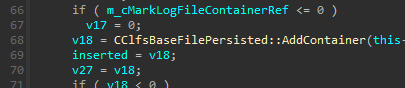

In `AddContainer`:

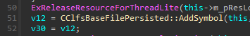

We take a look at `AddSymbol` in IDA:

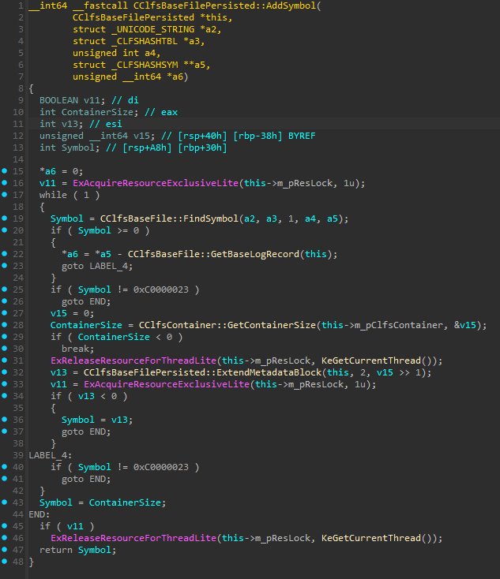

We see that on line 19, it calls `FindSymbol` and saves the result to a variable, and it then checks whether the result is >= 0. If the result has no error (>= 0), it jumps to LABEL_4 which then jumps to END, skipping past `ExtendMetadataBlock` entirely. Since we want it to execute `ExtendMetadataBlock`, we need to get a specific error (`0xC0000023`) on `FindSymbol`, since the return result is checked again against `0xC0000023` on line 25, jumping to END if it isn't equal.

Taking a look at `FindSymbol`, we can see many different error codes, but `0xC0000023` seems to be missing. There is however one line of code that we can see:

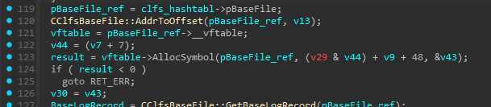

It calls a function from the input vftable called "AllocSymbol". While a search in IDA we can find `CClfsBaseFilePersisted::AllocSymbol`, we can't be completely sure, so we hop into the debugger and set a breakpoint at `FindSymbol`, we can see the vftable being passed in:

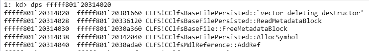

At offset `0x18`, we see `CClfsBaseFilePersisted::AllocSymbol`.

Looking inside `AllocSymbol`:

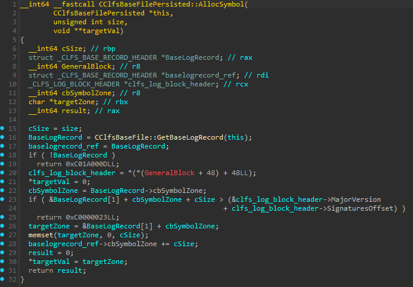

We can now see `0xC0000023` being returned if we fail the check at line 23. In order to fail the check, we just have to make sure `cbSymbolZone` + `cSize` puts the pointer past the end of the current block.

One thing to note is that within `OpenImage`, we can see that in order for `ExtendMetadatBlock` to be called, `eExtendState` needs to be != 0 or the function would just end:

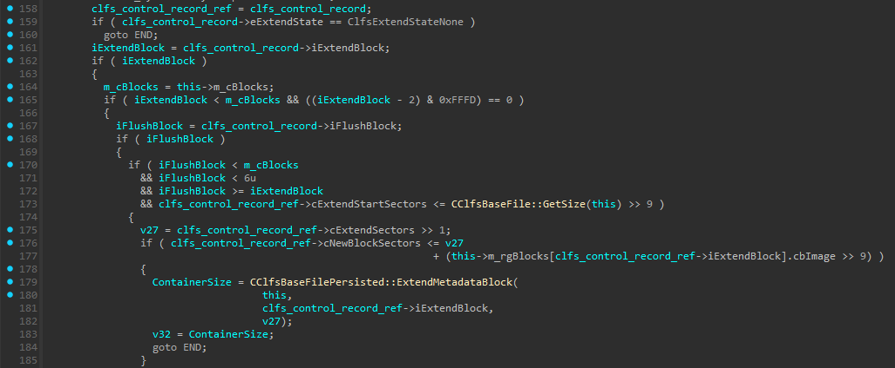

Where ClfsExtendStateNone is the enum for 0.
We can also see that it checks the values of `iExtendBlock` and `iFlushBlock` such that in order to reach `ExtendMetadataBlock` we would have to ensure
1. `iExtendBlock` > 0 and `iFlushBlock` > 0
2. `iExtendBlock` < 6
3. `iFlushBlock` < 6 AND `iFlushBlock` >= `iExtendBlock`
4. `cExtendStartSectors` < Total no. of sectors
5. `cNewBlockSectors` < Total no. of sectors + sectors to extend

4 and 5 are automatically ensured for us as long as we don't tamper with it, so we just need to ensure `iExtendBlock` and `iFlushBlock` meet the requirements.

Within `ExtendMetadataBlock`, we can see this block that checks for `eExtendState`:

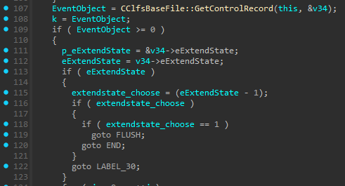

Where the label END leads to `ExtendMetadataBlock` finishing execution and FLUSH leads to:

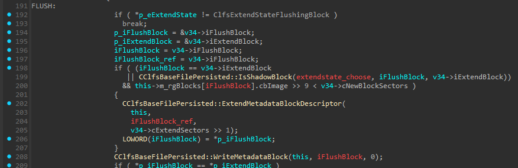

This is the `WriteMetadataBlock` that we need to reach, since as seen above we must have `eExtendState` != 0. We can also then see on line 192 above that we must have `eExtendState` = `ClfsExtendStateFlushingBlock` in order for the code to proceed.

Now that we know how to trigger our desired code path twice, let's understand the primitive that can be used to exploit this.

## The Primitive

The primitive that was used here lies within the `WriteMetadataBlock` function. After obtaining an offset to a metadata block (CONTROL, BASE, etc.), the code attempts to increment `header->ullDumpCount`, whose offset is stored at `header->RecordOffsets[0]` (fixed at 0x70):

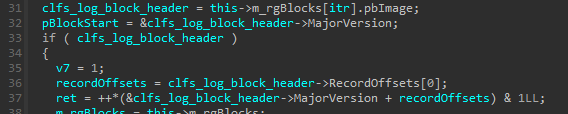

Within `ExtendMetadataBlock`, `iFlushBlock` is passed into `WriteMetadataBlock` as `itr`, which is used to obtain an address from `m_rgBlocks`. `pbImage` exists at offset 0 of `m_rgBlocks`, and `m_rgBlocks` is a struct of `0x30` size in memory. Thus, with this, we are able to reference an arbitrary address in memory.

`MajorVersion` here is just offset 0 of `clfs_log_block_header`, so it can be treated as a pointer to the start of the struct.

Since `RecordOffsets[0]` is always `0x70` for metadata blocks, in line 37 we have an arbitrary increment on our controllable location of `clfs_log_block_header + 0x70`.

# Crafting a POC
To craft a POC, recalling from the analysis, we have to do the following things:
1. Create a log file that we can work with
2. Patch the log file (Offset -> Name in struct)

    **CONTROL Block**
    - 0x6 → Control.ValidSectors: 1
      - This causes `ValidSectors < TotalSectors`, failing `ValidSectors == TotalSectors` check
      - Causes ClfsDecodeBlock to fail
      - Leaves zeroed checksum in memory
    - 0x70 → Control.DumpCount: 2
      - Must be >= ControlShadow.DumpCount
      - This ensures CONTROL block is attempted to be read first, corrupting the checksum
    - 0x84 → Control.eExtendState: 2
      - We use enum ClfsExtendStateFlushingBlock to pass the checks in `OpenImage` and `ExtendMetadataBlock`
      - This lets us reach `WriteMetadataBlock`
    - 0x88 → Control.iExtendBlock: 2
      - Nonzero value n, 1 < n < 6
      - By default, there are 2 blocks, so indexes 0 and 1 already exist
    - 0x8A → Control.iFlushBlock: 2
      - Nonzero value n, 1 < n < 6, n >= `iExtendBlock`
      - We set this to be equals to `iExtendBlock` such that execution ends upon one execution of `WriteMetadataBlock`
    - 0x94 → Control.cExtendSectors: 1
      - Must be >= 1 to trigger `ExtendMetadataBlock`

    **CONTROL_SHADOW Block**:
    - 0x6 → ControlShadow.ValidSectors: 2
      - Ensure that it matches TotalSectors to pass `ValidSectors == TotalSectors` check
    - 0x470 → ControlShadow.DumpCount: 1
      - Must be <= Control.DumpCount
      - This ensures CONTROL block is attempted to be read first
    - 0x484 → ControlShadow.eExtendState: 2 (same as CONTROL)
    - 0x488 → ControlShadow.iExtendBlock: 0xBEEF
      - Can be any malicious value
    - 0x48A → ControlShadow.iFlushBlock: 0xDEAD
      - Can be any malicious offset

    **BASE Block**:
    - 0x1B98 → BaseBlock.cbSymbolZone: 0x6543
      - Must be a value large enough to cause `AllocSymbol` error `0xC0000023`
      - Cannot be too large or it will be caught by other code

    **BASE_SHADOW Block**:
    - 0x9598 → BaseShadow.cbSymbolZone: 0x6543 (same as BaseBlock)

3. Call `CreateLogFile` to corrupt CONTROL block
4. Call `AddLogContainer` on returned handle to get OOB increment

In my POC, I do the following:
1. Call `CreateLogFile` with `OPEN_ALWAYS` to create a log file
2. Open the log file with `fopen` and patch values as seen above
3. Call `CreateLogFile` again to open the patched log file, and keep the handle
4. Call `AddLogContainer` on the handle from #3

We can step into the debugger and see our malicious `iExtendBlock` and `iFlushBlock` in memory by setting breakpoints at `ExtendMetadataBlock`, `GetControlRecord` and `WriteMetadataBlock`, then once we reach `ExtendMetadataBlock` -> `GetControlRecord` -> `WriteMetadataBlock`, we take the value in $rcx (`CClfsBaseFilePersisted` object), examine the object and take the value at offset 0x30 (`pbImage`), then examine the pointer at either offset 0x0 or 0x30 (`rgBlocks` array -> CONTROL/CONTROL_SHADOW struct pointer) to see the contents of CONTROL loaded into memory.
```
2: kd> dps ffffc607`1568d280 l12
ffffc607`1568d280  00020002`00010015
ffffc607`1568d288  00000000`00000000
ffffc607`1568d290  00000000`00000002
ffffc607`1568d298  ffffffff`00000000
ffffc607`1568d2a0  ffffffff`00000000
ffffc607`1568d2a8  00000000`00000070
ffffc607`1568d2b0  00000000`00000000
ffffc607`1568d2b8  00000000`00000000
ffffc607`1568d2c0  00000000`00000000
ffffc607`1568d2c8  00000000`00000000
ffffc607`1568d2d0  00000000`00000000
ffffc607`1568d2d8  00000000`00000000
ffffc607`1568d2e0  00000000`00000000
ffffc607`1568d2e8  00000000`000003f8
ffffc607`1568d2f0  00000000`00000001
ffffc607`1568d2f8  c1f5c1f5`00005f1c
ffffc607`1568d300  00000002`00000001
ffffc607`1568d308  00000000`deadbeef    <-- We see our malicious values here
```
We can see that after the magic number, in the area where `iExtendBlock` and `iFlushBlock` is supposed to be, `deadbeef` sits in memory.

## Afterword

This was a fun and tiring journey as many writeups online lead to dead ends and incorrect information. I was finally able to find a writeup that explained the vulnerability from an attacker's point of view which helped greatly, though at that point I was already on the cusp of finding out the information myself.

Huge thanks to all the public resources out there, they assisted me greatly when I was learning CLFS internals.

That's all for now, maybe when I find something interesting again and stop procrastinating I'll write another post.

Thanks for reading.

## References (non-exhaustive)
- [Unofficial CLFS Documentation](https://github.com/ionescu007/clfs-docs)
- https://github.com/fortra/CVE-2023-28252/tree/master?tab=readme-ov-file
- https://bbs.kanxue.com/thread-278241.htm
- https://securelist.com/windows-clfs-exploits-ransomware-cve-2023-28252/111601/
- https://securelist.com/nokoyawa-ransomware-attacks-with-windows-zero-day/109483/
- https://github.com/726232111/CVE-2023-28252/tree/main
- https://ti.qianxin.com/blog/articles/CVE-2023-28252-Analysis-of-In-the-Wild-Exploit-Sample-of-CLFS-Privilege-Escalation-Vulnerability/