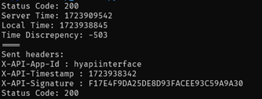
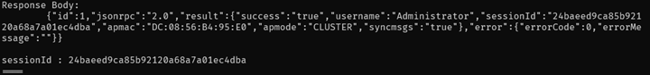
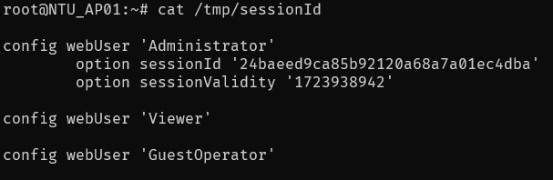
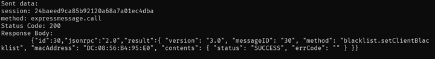
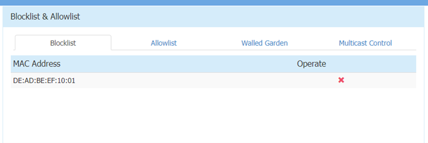
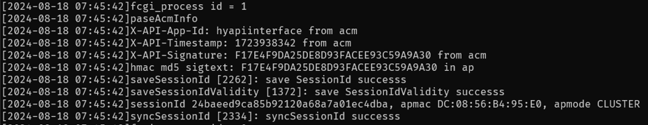

## Foreword

In August of 2024, I participated in SpiritCyber, a 0-day hacking competition held during Singapore International Cyber Week (SICW) 2024 with my team, Team SeeSeeTV. This was quite a fresh experience for me as I had never done vulnerability research on IoT devices before.

This post details one of the vulnerabilities I found in the provided Alcatel-Lucent router.

# The Basics

Disclosure or Patch Date: `16 July 2025`

Product: `Alcatel-Lucent Enterprise AP1361D Wi-Fi Access Point`

Advisory: [CSA Advisory](https://www.csa.gov.sg/alerts-and-advisories/alerts/al-2025-072) | [Alcatel-Lucent Security Advisory](https://www.al-enterprise.com/-/media/assets/internet/documents/sa-n0150-ed02-omniaccess-stellar-multiple-vulnerabilities.pdf)

Affected Versions: `4.0.4` and possibly other earlier versions

First Patched Version: `N/A. It will only be available on Alcatel's extranet which is only accessible to Business Partners. Hence, affected users have to reach out to their Business Partners to update their vulnerable product.`

Issue/Bug Report: `CVE-2025-52689`

Severity: `Critical`

Attack Type: `Network`

CVSS 3.1 Base Score: `9.8`

CVSS Vector: `CVSS:3.1/AV:N/AC:L/PR:N/UI:N/S:U/C:H/I:H/A:H`

Reporter(s): `uhg | Team SeeSeeTV (SpiritCyber 2025)`

# Timeline

- 2024-08-18: Report submitted to SpiritCyber IoT Hackathon triage team
- 2024-08-18: Report accepted by triage team
- ...
- 2025-06-25: CSA assigns CVE-2025-52689
- 2025-07-16: Public disclosure

# The Code

Proof-of-concept: [On Github](https://github.com/UltimateHG/CVE-2025-52689-PoC)

# The Vulnerability

## Root Cause

**Bug class:** [[CWE-1390] Weak Authentication](https://cwe.mitre.org/data/definitions/1390.html)

**Vulnerability details:** Exposed authentication endpoint performs verification with hardcoded values and keys, allowing an attacker to generate a valid set of authentication data and obtain an administrator session token without needing to know the login details of the administrator.

## High-level Overview

Authentication endpoint is exposed at `/echo.fcgi/api/login` to the network.

Requests that reach the endpoint arrive at an authentication function, which checks 3 input variables before returning a valid administrator session token:
- X-API-App-Id
  - Hardcoded string `"hyapiinterface"`
- X-API-Timestamp
  - Checked to ensure it is within 5 minutes of system time
- X-API-Signature
  - Checked against system-generated signature
  - System-generated signature is obtained by hashing (HMAC-MD5) X-API-Timestamp with hardcoded key `"hyadasdfasdf32eb"`

This allows for an attacker to generate a valid set of input variables and obtain a valid administrator session token.

## Execution Flow Analysis

echo.fcgi handles login requests from the web admin interface. A request first arrives at `login_requests` (0xC308), which checks the requested endpoint against `/echo.fcgi/api/login` before calling the `api_login` function (0xB4CC):
```c++
...
if ( FCGX_GetParam() && (req_endpoint = FCGX_GetParam()) != 0 && strstr(req_endpoint, "api/login") )
{
  api_login(a1);
}
...
```

Once we reach `api_login`, a few checks are performed and the response body is set with the appropriate result, after which the response is then returned to the sender of the request.
```
main
-> login_requests (sub_C308)
-> api_login (sub_B4CC)
-> get X-API-App-Id
-> get X-API-Timestamp
-> get X-API-Signature
-> check params
-> set response body
```

## Vulnerable Function Analysis

The vulnerability exists within `api_login (sub_B4CC)`, which is broken down below:

The function starts by getting 3 parameters from the request content, we can tell what the variables are by looking at the log commands.

```c++
x_api_app_id = FCGX_GetParam();
app_id = x_api_app_id;
if ( x_api_app_id )   // Check that app id exists
{
  lighttpd_log("X-API-App-Id: %s from acm\n", x_api_app_id);
  x_api_timestamp = FCGX_GetParam();
  unix_timestamp = x_api_timestamp;
  if ( x_api_timestamp )    // Check that timestamp exists
  {
    lighttpd_log("X-API-Timestamp: %s from acm\n", x_api_timestamp);
    x_api_signature = FCGX_GetParam();
    signature = x_api_signature;
    if ( x_api_signature )    // Check that signature exists
    {
      lighttpd_log("X-API-Signature: %s from acm\n", x_api_signature);
      ...
```

First check is performed, `X-API-Timestamp` is checked to be within 5 minutes of system time.

```c++
// Check #1: Timestamp is within 300s (5 mins) of system time
if ( atol(unix_timestamp) < sys_time - 300 || atol(unix_timestamp) > sys_time + 300 )
{
  // ...Truncated code to set response body to failure message...
}
```

Second check is trivial, `X-API-App-Id` is checked against a hardcoded string `"hyapiinterface"`.

```c++
// Check #2: X-API-App-Id is "hyapiinterface"
if ( !strcmp(app_id, "hyapiinterface") )
{
  ...
```

After which, `X-API-Timestamp` is hashed with a HMAC-MD5 function and the output is converted to a string. Then, check #3 occurs where the hash is checked against `X-API-Signature`.

```c++
timestamp_len = strlen(unix_timestamp);
// Hash input timestamp with HMAC-MD5, hardcoded key "hyadasdfasdf32eb"
// THIS IS A MAJOR VULNERABILITY!
hmac_func(unix_timestamp, timestamp_len, "hyadasdfasdf32eb", 16, hmac_hash);
// ...Truncated code to convert hmac_hash to a string...
lighttpd_log("hmac md5 sigtext: %s in ap\n", hmac_hash_str);
// Check #3: Signature matches with hmac-md5 hash
if ( strcmp(signature, hmac_hash_str) )
{
  lighttpd_log("X-API-Signature error\n");
  // Truncated code (signature error)
}
...
```

We can see that once all the checks are passed, we reach the success code where a session id is generated, synced locally and then returned via the response body.

```c++
// Get relevant information
popen_wrap("getmode", &apmode, 0xAu);
popen_wrap("/usr/sbin/showsysinfo | awk -F 'MAC:' '/MAC/ {print $2}'", mac_addr, 0x32u);
popen_wrap("showsysinfo | awk -F \"License Control:\" '/License Control/ {print $2}'", license, 0x41u);
apmode_str = get_apmode(&apmode, license);
// Generate session ID
generated_sessionId = generate_session_id();
strcpy(sessionId, generated_sessionId);
response = &request[10 * v1];
// Set response body with success message
FCGX_FPrintF(response->responseBody, "Status: 200 OK\r\n");
FCGX_FPrintF(response->responseBody, "Content-Type: text/plain\r\n\r\n");
FCGX_FPrintF(response->responseBody, "\t{\"id\":1,\"jsonrpc\":\"2.0\",");
// Write new sessionId to local file /tmp/sessionId
if ( (sync_sessionId("Administrator", sessionId, apmode_str) & 0x80000000) != 0 )
{
  responseContent = "\"error\":{\"errorCode\":-1,\"errorMessage\":\"login_log_saveSessionid_error\" }}\n";
}
else
{
  // Set sessionId validity and save to local file /tmp/sessionId
  if ( (sync_sessionId_validity("Administrator") & 0x80000000) == 0 )
  {
    // Append sessionId and other information to response body
    FCGX_FPrintF(
      response->responseBody,
      "\"result\":{\"success\":\"true\",\"username\":\"Administrator\",\"sessionId\":\"%s\",\"apmac\":\"%s\",\""
      "apmode\":\"%s\",\"syncmsgs\":",
      sessionId,
      mac_addr,
      &apmode);
    lighttpd_log("sessionId %s, apmac %s, apmode %s\n", sessionId, mac_addr, &apmode);
    ...
```

As such, username and password is not checked at all, and we can see that the only 3 checks within the login API function are easily bypassable by an attacker.

# The Exploit

## Exploit strategy

Send an authentication request to the vulnerable endpoint with a specially-crafted payload to obtain a valid administrator session token. This token can then be used to send any API request to the router.

## Exploit Flow

1. Send any HTTP request to the router's web interface to obtain a timestamp from the default HTTP response header
2. Adjust timestamp to match server
3. Generate HMAC-MD5 hash
4. Send forged request to `/echo.fcgi/api/login` with the following
    - `X-API-App-Id`: `hyapiinterface`
    - `X-API-Timestamp`: Server timestamp
    - `X-API-Signature`: Generated hash
5. Obtain valid admin session token
6. Send any admin panel request with obtained token

## Vulnerability Trigger Verification

After sending the following request:



We receive a response containing an admin session token:



We can also verify that we obtained a valid admin session token by checking the /tmp/sessionId file on the router:



To prove we are able to send arbitrary web panel requests to the router, we can send a HTTP request to add MAC address `DE:AD:BE:EF:10:01` to the blacklist ("blocklist"):



We can see it reflected within our web panel as well:



We can also see relevant functions being called and verification succeeding within the lighttpd logs (/var/log/lighttpd/cgi.log):



# The Next Steps

## Detection

Lighttpd API requests are logged within the router's file system at /var/log/lighttpd/cgi.log. Using the following legend:
```
TIMESTAMP: System timestamp, in format YYYY-MM-DD HH:MM:SS
UNIX_TIME: Unix timestamp
SIGNATURE: Generated signature from timestamp
ADM_TKN: Admin session token
MAC_ADDR: MAC address of router
APMODE: AP mode of router
####: Any integer
```
The following set of strings should be generated within the logs any time authentication is done:
```
...
[TIMESTAMP]parseAcmInfo
[TIMESTAMP]X-API-App-Id: hyapiinterface from acm
[TIMESTAMP]X-API-Timestamp: UNIX_TIME from acm
[TIMESTAMP]X-API-Signature: SIGNATURE from acm
[TIMESTAMP]hmac md5 sigtext: SIGNATURE in ap
[TIMESTAMP]saveSessionId [####]: save SessionId success
[TIMESTAMP]saveSessionIdValidity [####]: save SessionIdValidity success
[TIMESTAMP]sessionId ADM_TKN, apmac MAC_ADDR, apmode APMODE
[TIMESTAMP]syncSessionId [####]: syncSessionId success
...
```

If the above logs are printed yet no legitimate login attempt had been made at the specified TIMESTAMP, the router has likely been compromised.

## Mitigations

Alcatel recommends users of affected product to update to the latest version. If updating to the latest version is not possible, the workaround measure is to manage the affected product using Enterprise Mode with OmniVista Management platform and disable the web interface.

For the patch, Alcatel mentioned that it will only be available on their extranet which is only accessible to their Business Partners. Hence, the affected users have to reach out to their Business Partners to update their vulnerable product.

## Variant analysis

Our approach and other areas we visited for variant analysis: 
- Other functions handling input data for authentication-related endpoints
- Other potential authentication functions

Although there were many other vulnerabilities, we did not find other vulnerabilities of the same nature within the firmware.

## Afterword

This was my introduction to IoT security so I was very happy to have learnt a lot during this venture. In its own way, it almost felt like a CTF competition as there were much more vulnerabilities than I first expected there would be, so a fair amount of time is actually dedicated to crafting a proper POC to exploit the vulnerability.

One thing, however, is that our team only really paid attention to the "good" bugs, i.e. bugs that can be exploited which are not just denial-of-service bugs, but as we learnt later on many other teams just submitted whatever vulnerabilities they found as potential bugs, so maybe we should've done that as well to max out our bounty.

Nonetheless, this was a fun experience and I honestly wouldn't mind playing again if I had the chance to.

Do check out the other interesting bugs found by my teammates in the same target: [CVE-2025-52688](https://jro.sg/CVEs/CVE-2025-52688/) | [CVE-2025-52690](https://jro.sg/CVEs/CVE-2025-52690/)

Thanks for reading.

### Huge thanks to

- My teammates who helped immensely during the competition (Thank you [jro](https://jro.sg/) for dumping the live firmware!)
- NTU and STAR Labs SG for organising the competition and helping to triage all the bugs